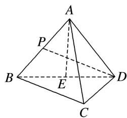

<!-- question-source:start -->
[例1] 如图，在三棱锥 $A - BCD$ 中， $AB = BD = AD = AC = 2$ ， $\triangle BCD$ 是以 $BD$ 为斜边的等腰直角三角形， $P$ 为 $AB$ 的中点， $E$ 为 $BD$ 的中点.

(1)求证： $AE \perp$ 平面 BCD;

(2)求直线 $PD$ 与平面 $ACD$ 所成角的正弦值.

<!-- question-source:end -->

![[高中/总复习/专题/立体几何/专题10 利用空间向量计算线面角的问题-立体几何（理科）/考点02_棱_圆_锥模型/例题/answers/Q00043658A1.md]]
