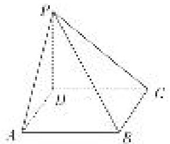

<!-- question-source:start -->
[例 2] (2020·新山东)如图，四棱锥 P-ABCD 的底面为正方形， $PD \perp$ 底面 ABCD．设平面 PAD 与平面 PBC 的交线为 l.

(1)证明： $l \perp$ 平面 PDC;

(2)已知 $PD = AD = 1$ ， $Q$ 为 $l$ 上的点，求 $PB$ 与平面 $QCD$ 所成角的正弦值的最大值.

<!-- question-source:end -->

![[高中/总复习/专题/立体几何/专题10 利用空间向量计算线面角的问题-立体几何（理科）/考点02_棱_圆_锥模型/例题/answers/Q00043659A1.md]]
