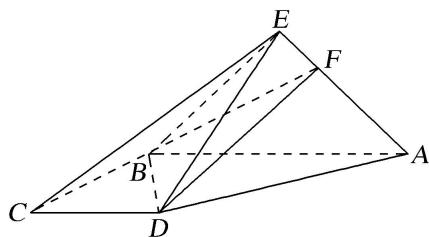

<!-- question-source:start -->
[例 3] 如图，在四棱锥 E-ABCD 中，底面 ABCD 为直角梯形， $AB \parallel CD$ ， $BC \perp CD$ ， $AB = 2BC = 2CD$ 。 $\triangle EAB$ 是以 AB 为斜边的等腰直角三角形，且平面 $EAB \perp$ 平面 ABCD。点 F 满足： $\overrightarrow{EF} = \lambda \overrightarrow{EA} (\lambda \in [0, 1])$ 。

(1)试探究 $\lambda$ 为何值时， $CE / /$ 平面 $BDF$ ，并给予证明；

(2)在
(1)的条件下，求直线 AB 与平面 BDF 所成角的正弦值.

<!-- question-source:end -->

![[高中/总复习/专题/立体几何/专题10 利用空间向量计算线面角的问题-立体几何（理科）/考点02_棱_圆_锥模型/例题/answers/Q00043660A1.md]]
