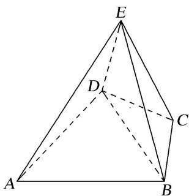
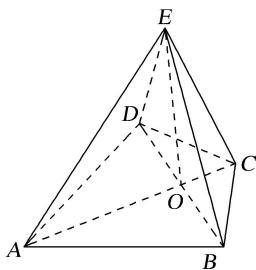
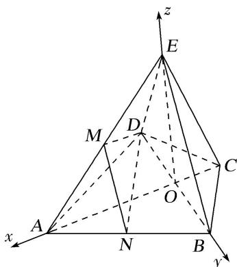

<!-- question-source:start -->
[例 4] 如图，在四棱锥 E-ABCD 中，底面 ABCD 是圆内接四边形， $CB=CD=CE=1$ ， $AB=AD=AE=\sqrt{3}$ ， $EC\perp BD$ .

(1)求证：平面 $BED \perp$ 平面 $ABCD$ ;

(2)若点 $P$ 在平面 $ABE$ 内运动，且 $DP \parallel$ 平面 $BEC$ ，求直线 $DP$ 与平面 $ABE$ 所成角的正弦值的最大值.

(1)如图，连接 AC，交 BD 于点 O，连接 EO，

$\because AD = AB, CD = CB, AC = AC, \therefore \triangle ADC \cong \triangle ABC,$ 易得 $\triangle ADO \cong \triangle ABO,$ $\therefore \angle AOD = \angle AOB = 90^{\circ}, \therefore AC \perp BD.$ 又 $EC \perp BD, EC \cap AC = C, \therefore BD \perp$ 平面 $AEC,$ 又 $OE \subset$ 平面 $AEC, \therefore OE \perp BD.$ 又底面 $ABCD$ 是圆内接四边形， $\therefore \angle ADC = \angle ABC = 90^{\circ}$ ，在 Rt $\triangle ADC$ 中，由 $AD = \sqrt{3}, CD = 1$ ，可得 $AC = 2, AO = \frac{3}{2}, \therefore \angle AEC = 90^{\circ}, \frac{AE}{AC} = \frac{AO}{AE} = \frac{\sqrt{3}}{2}$ ，易得 $\triangle AEO \sim \triangle ACE, \therefore \angle AOE = \angle AEC = 90^{\circ}$ ，即 $EO \perp AC.$ 又 $AC, BD \subset$ 平面 $ABCD, AC \cap BD = O, \therefore EO \perp$ 平面 $ABCD,$ 又 $EO \subset$ 平面 $BED, \therefore$ 平面 $BED \perp$ 平面 $ABCD.$
(2)如图，取 $AE$ 的中点 $M, AB$ 的中点 $N$ ，连接 $MN, ND, DM,$ 则 $MN // BE,$ 由
(1)知， $\angle DAC = \angle BAC = 30^{\circ}$ ，即 $\angle DAB = 60^{\circ}$ ，

∴△ABD为正三角形，∴DN⊥AB，又BC⊥AB，∴平面DMN//平面EBC，∴点P在线段MN上.以O为坐标原点，建立如图所示的空间直角坐标系，

则 $A\left(\frac{3}{2}, 0, 0\right), B\left(0, \frac{\sqrt{3}}{2}, 0\right), E\left(0, 0, \frac{\sqrt{3}}{2}\right), M\left(\frac{3}{4}, 0, \frac{\sqrt{3}}{4}\right), D\left(0, -\frac{\sqrt{3}}{2}, 0\right), N\left(\frac{3}{4}, \frac{\sqrt{3}}{4}, 0\right)$ ,

$$
\therefore \overrightarrow {A B} = \left[ - \frac {3}{2}, \frac {\sqrt {3}}{2}, 0 \right], \overrightarrow {A E} = \left[ - \frac {3}{2}, 0, \frac {\sqrt {3}}{2} \right], \overrightarrow {D M} = \left[ \frac {3}{4}, \frac {\sqrt {3}}{2}, \frac {\sqrt {3}}{4} \right], \overrightarrow {M N} = \left[ 0, \frac {\sqrt {3}}{4}, - \frac {\sqrt {3}}{4} \right],
$$

设平面 $ABE$ 的法向量 $\pmb {n} = (x,y,z)$ ，则 $\left\{ \begin{array}{l}\overrightarrow{AB}\cdot \pmb {n} = 0,\\ \overrightarrow{AE}\cdot \pmb {n} = 0, \end{array} \right.$ 即 $\left\{ \begin{array}{l} - \sqrt{3} x + y = 0,\\ -\sqrt{3} x + z = 0, \end{array} \right.$ 令 $x = 1$ ，则 $\pmb {n} = (1,\sqrt{3},\sqrt{3})$

设 $\overrightarrow{MP} = \lambda \overrightarrow{MN} (0\leq \lambda \leq 1)$ ，可得 $\overrightarrow{DP} = \overrightarrow{DM} +\overrightarrow{MP} = \left[\frac{3}{4},\frac{\sqrt{3}}{2} +\frac{\sqrt{3}}{4}\lambda ,\frac{\sqrt{3}}{4} -\frac{\sqrt{3}}{4}\lambda \right],$

设直线 DP 与平面 ABE 所成的角为 $\theta$ ，则 $\sin\theta=\left|\frac{n\cdot\overrightarrow{DP}}{|n|\cdot|\overrightarrow{DP}|}\right|=\frac{12}{\sqrt{42}\times\sqrt{\lambda^{2}+\lambda+4}}$

$\because 0 \leq \lambda \leq 1, \therefore$ 当 $\lambda = 0$ 时， $\sin \theta$ 取得最大值 $\frac{\sqrt{42}}{7}$ .

故直线 DP 与平面 ABE 所成角的正弦值的最大值为 $\frac{\sqrt{42}}{7}$ .
<!-- question-source:end -->

![[高中/总复习/专题/立体几何/专题10 利用空间向量计算线面角的问题-立体几何（理科）/考点02_棱_圆_锥模型/例题/answers/Q00043661A1.md]]
