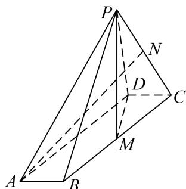
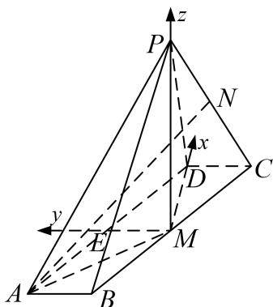

<!-- question-source:start -->
[例 5] (2021·浙江)如图，在四棱锥 P-ABCD 中，底面 ABCD 是平行四边形， $\angle ABC=120^{\circ}$ ，AB=1，BC=4， $PA=\sqrt{15}$ ，M，N 分别为 BC，PC 的中点， $PD\perp DC$ ， $PM\perp MD$ .

(1)证明： $AB \perp PM;$

(2)求直线 AN 与平面 PDM 所成角的正弦值.

(1)在平行四边形ABCD中，由已知可得， $CD=AB=1,\quad CM=\frac{1}{2}BC=2,\quad \angle DCM=60^{\circ}$

所以由余弦定理可得， $DM^{2} = CD^{2} + CM^{2} - 2\cdot CD\cdot CM\cdot \cos 60^{\circ} = 3$

则 $CD^{2}+DM^{2}=1+3=4=CM^{2}$ ，即 $CD \perp DM$ ，

又 $PM \perp MD$ ， $PM \cap DM = M$ ，所以 $CD \perp$ 平面 PDM，

而 $PM \subset$ 平面 $PDM$ ，所以 $CD \perp PM$ 。因为 $CD \parallel AB$ ，所以 $AB \perp PM$ 。

(2)由
(1)知， $CD \perp$ 平面 PDM，又 $CD \subset$ 平面 ABCD，所以平面 $ABCD \perp$ 平面 PDM，
且平面 ABCD 平面 $\cap PDM = DM$ ，因为 $PM \perp DM$ ，且 $PM \subset$ 平面 PDM，所以 $PM \perp$ 平面 ABCD，
连接 AM，则 $PM \perp MA$ ，在 $\triangle ABM$ 中，AB=1，BM=2， $\angle ABM=120^{\circ}$

可得 $AM^{2}=1+4-2\cdot1\cdot2\cdot(-\frac{1}{2})=7,$

又 $PA = \sqrt{15}$ ，在 Rt△PMA 中，求得 $PM = 2\sqrt{2}$

取 AD 中点 E，连接 ME，则 $ME \parallel CD$ ，可得 ME、MD、MP 两两互相垂直，

以 M 为坐标原点，分别以 MD、ME、MP 分别为 x 轴、y 轴、z 轴建立空间直角坐标系，则 $A(-\sqrt{3}, 2, 0)$ ， $P(0, 0, 2)$ ， $C(\sqrt{3}, -1, 0)$ 。又 N 为 PC 的中点，

所以 $N(\frac{\sqrt{3}}{2}, -\frac{1}{2}, \sqrt{2})$ ， $\overrightarrow{AN} = (\frac{3\sqrt{3}}{2}, -\frac{5}{2}, \sqrt{2})$ ,

平面 PDM 的一个法向量为 $n=(0,1,0)$ ,

设直线 AN 与平面 PDM 所成角为 $\theta$ ，则 $\sin\theta=|\cos<\overrightarrow{AN},\quad n>|=\frac{|n\cdot\overrightarrow{AN}|}{|n|\cdot|\overrightarrow{AN}|}=\frac{\sqrt{15}}{6}$ ,

故直线 AN 与平面 PDM 所成角的正弦值为 $\frac{\sqrt{15}}{6}$ .
<!-- question-source:end -->

![[高中/总复习/专题/立体几何/专题10 利用空间向量计算线面角的问题-立体几何（理科）/考点02_棱_圆_锥模型/例题/answers/Q00043662A1.md]]
