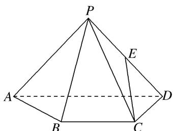
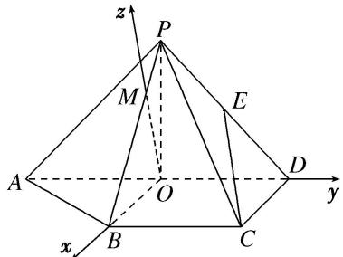
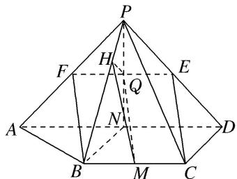

<!-- question-source:start -->
[例 6] (2017·浙江)如图, 已知四棱锥 P-ABCD, $\triangle PAD$ 是以 AD 为斜边的等腰直角三角形, BC // AD, CD ⊥ AD, PC = AD = 2DC = 2CB, E 为 PD 的中点.

(1)证明： $CE \parallel$ 平面 PAB;

(2)求直线 CE 与平面 PBC 所成角的正弦值.

(1) 设 AD 的中点为 O，连接 OB，OP. ∵△PAD 是以 AD 为斜边的等腰直角三角形，∴ OP⊥AD. ∵ BC= $\frac{1}{2}$ AD=OD，且 BC∥OD，

∴四边形 BCDO 为平行四边形，又∵CD⊥AD，∴OB⊥AD，∵OP∩OB，∴AD⊥平面 OPB.

过点 O 在平面 POB 内作 OB 的垂线 OM，交 PB 于 M，

以 O 为原点，OB 所在直线为 x 轴，OD 所在直线为 y 轴，OM 所在直线为 z 轴，建立空间直角坐标系，如图．设 CD=1，则有 A(0, -1, 0)，B(1, 0, 0)，C(1, 1, 0)，D(0, 1, 0)．设 P(x, 0, z)(z>0)，

由 PC=2, OP=1，得 $\left\{\begin{aligned}(x-1)^{2}+1+z^{2}&=4,\\ x^{2}+z^{2}&=1,\end{aligned}\right.$ 得 $x=-\frac{1}{2}, z=\frac{\sqrt{3}}{2}.$ 即点 $P\left(-\frac{1}{2},0,\frac{\sqrt{3}}{2}\right)$ ,

而 E 为 PD 的中点， $\therefore E\left(-\frac{1}{4},\frac{1}{2},\frac{\sqrt{3}}{4}\right)$ .

设平面 PAB 的法向量为 $\boldsymbol{n}=(x_{1},y_{1},z_{1})$ ,

$\because \overrightarrow{AP} = \left(-\frac{1}{2}, 1, \frac{\sqrt{3}}{2}\right), \overrightarrow{AB} = (1, 1, 0), \therefore \left\{ \begin{array}{l} -\frac{1}{2} x_1 + y_1 + \frac{\sqrt{3}}{2} z_1 = 0, \\ x_1 + y_1 = 0, \end{array} \right.$ 取 $y_1 = -1$ ，得 $n = (1, -1, \sqrt{3})$

而 $\overrightarrow{CE} = \left(-\frac{5}{4}, -\frac{1}{2}, \frac{\sqrt{3}}{4}\right)$ ，则 $\overrightarrow{CE} \cdot n = 0$ ，而 $CE \notin$ 平面 $PAB$ ， $\therefore CE //$ 平面 $PAB$ .

(2)设平面 $PBC$ 的法向量为 $\pmb {m} = (x_2,y_2,z_2)$ ， $\because \overrightarrow{BC} = (0,1,0),\overrightarrow{BP} = \left(-\frac{3}{2},0,\frac{\sqrt{3}}{2}\right),$

$\therefore \left\{ \begin{array}{l} y_{2} = 0, \\ -\frac{3}{2} x_{2} + \frac{\sqrt{3}}{2} z_{2} = 0, \end{array} \right.$ 取 $x_{2} = 1$ ，得 $m = (1, 0, \sqrt{3})$

设直线 $CE$ 与平面 $PBC$ 所成角为 $\theta$ 。则 $\sin \theta = |\cos < m, \overrightarrow{CE} >| = \frac{|\overrightarrow{CE} \cdot m|}{|\overrightarrow{CE}| \cdot |m|} = \frac{\sqrt{2}}{8}$ ,

故直线 CE 与平面 PBC 所成角的正弦值为 $\frac{\sqrt{2}}{8}$ .

(几何法):
(1)如图, 设 $PA$ 的中点为 $F$ , 连接 $EF$ , $FB$ . 因为 $E$ , $F$ 分别为 $PD$ , $PA$ 的中点, 所以 $EF \parallel AD$ 且 $EF = \frac{1}{2} AD$ . 又因为 $BC \parallel AD$ , $BC = \frac{1}{2} AD$ , 所以 $EF \parallel BC$ 且 $EF = BC$ ,

即四边形 BCEF 为平行四边形，所以 CE // BF.

因为 $BF \subset$ 平面 PAB， $CE \notin$ 平面 PAB，所以 CE // 平面 PAB.

(2)分别取 BC, AD 的中点为 M, N. 连接 PN 交 EF 于点 Q, 连接 MQ, BN.

因为 E, F, N 分别是 PD, PA, AD 的中点，所以 Q 为 EF 的中点，

在平行四边形 BCEF 中，MQ//CE．由△PAD 为等腰直角三角形得 PN⊥AD.

由 $DC \perp AD$ ，N 是 AD 的中点得 $BN \perp AD$ 。又 $PN \cap BN = N$ ，所以 $AD \perp$ 平面 PBN。

由 $BC \parallel AD$ 得 $BC \perp$ 平面 $PBN$ , 那么平面 $PBC \perp$ 平面 $PBN$ .

过点 Q 作 PB 的垂线，垂足为 H，连接 MH．则 MH 是 MQ 在平面 PBC 上的射影，

所以 $\angle QMH$ 是直线 $CE$ 与平面 $PBC$ 所成的角.

设 $CD = 1$ ，在 $\triangle PCD$ 中，由 $PC = 2$ ， $CD = 1$ ， $PD = \sqrt{2}$ 得 $CE = \sqrt{2}$

在 $\triangle PBN$ 中，由PN=BN=1， $PB=\sqrt{3}$ 得 $QH=\frac{1}{4}$ ，

在 Rt△MQH 中， $QH=\frac{1}{4}$ ， $MQ=\sqrt{2}$ ，所以 $\sin\angle QMH=\frac{\sqrt{2}}{8}$ ，

所以直线 CE 与平面 PBC 所成角的正弦值是 $\frac{\sqrt{2}}{8}$ .

【对点训练】
<!-- question-source:end -->

![[高中/总复习/专题/立体几何/专题10 利用空间向量计算线面角的问题-立体几何（理科）/考点02_棱_圆_锥模型/例题/answers/Q00043663A1.md]]
