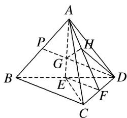
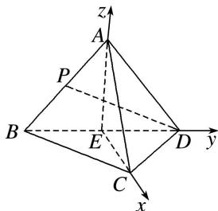

> [!faq]- 《专题10 利用空间向量计算线面角的问题-立体几何（理科）》例题解析
>
> > [!success]- **【答案】** 详见解析
>
> > [!note]- **【分析】**
> > 本题未单列分析。
>
> > [!note]- **【解析】**
> > 解析
> > (1)由题图可知， $\triangle ABD$ 是边长为 2 的等边三角形，
> >
> > ∵E为BD的中点，∴AE⊥BD，且 $AE=\sqrt{3}$ ，如图，连接CE，
> >
> > 
> >
> > ∵△BCD 是斜边长为 2 的等腰直角三角形，∴ $CE=\frac{1}{2}BD=1$ ，
> >
> > 在 $\triangle AEC$ 中， $AC=2$ ， $EC=1$ ， $AE=\sqrt{3}$ ， $\therefore AC^{2}=AE^{2}+EC^{2}$ ， $\therefore AE\perp EC$ .
> >
> > $\because BD\cap EC=E,\ BD\subset$ 平面 BCD, $EC\subset$ 平面 BCD, $\therefore AE\perp$ 平面 BCD.
> >
> > (2)方法一 取 CD 的中点 F，连接 AF，EF，∵ AC = AD，∴ CD ⊥ AF.
> >
> > 由
> > (1)可知， $AE \perp CD$ ，∵ $AE \cap AF = A$ ， $AE \subset$ 平面 AEF， $AF \subset$ 平面 AEF，∴ $CD \perp$ 平面 AEF，又 $CD \subset$ 平面 ACD，∴ 平面 $AEF \perp$ 平面 ACD.
> >
> > 设 PD，AE 相交于点 G，则点 G 为 $\triangle ABD$ 的重心，∴ $AG = DG = \frac{2}{3} AE = \frac{2\sqrt{3}}{3}$ .
> >
> > 过点 G 作 $GH \perp AF$ 于 H，则 $GH \perp$ 平面 ACD，
> >
> > 连接 DH，则 $\angle GDH$ 为直线 PD 与平面 ACD 所成的角.
> >
> > 易知 $\triangle AGH\sim \triangle AFE$ ， $EF = \frac{1}{2} BC = \frac{\sqrt{2}}{2}$ ， $AF = \frac{\sqrt{14}}{2}$ ，∴ $GH = \frac{AG}{AF}\cdot EF = \frac{\frac{2\sqrt{3}}{3}}{\sqrt{14}}\times \frac{\sqrt{2}}{2} = \frac{2\sqrt{21}}{21},$
> >
> > ∴ $\sin\angle GDH=\frac{GH}{DG}=\frac{\sqrt{7}}{7}$ ，即直线 PD 与平面 ACD 所成角的正弦值为 $\frac{\sqrt{7}}{7}$ .
> >
> > 方法二 由
> > (1)可知 $AE \perp$ 平面 BCD，且 $CE \perp BD$ ，∴ 可作如图所示的空间直角坐标系 E-xyz，
> >
> > 
> >
> > 则 $A(0, 0, \sqrt{3})$ , $C(1, 0, 0)$ , $D(0, 1, 0)$ , $P\left(0, -\frac{1}{2}, \frac{\sqrt{3}}{2}\right)$ ,
> >
> > $\vec{AD} = (0, 1, -\sqrt{3}), \vec{CD} = (-1, 1, 0), \vec{DP} = \left(0, -\frac{3}{2}, \frac{\sqrt{3}}{2}\right)$ ,
> >
> > 设平面 ACD 的一个法向量为 $\boldsymbol{n}=(x,y,z)$ ，∴ $\left\{\begin{aligned}\boldsymbol{n}\cdot\overrightarrow{AD}&=0,\\ \boldsymbol{n}\cdot\overrightarrow{CD}&=0,\end{aligned}\right.$ 即 $\left\{\begin{aligned}y-\sqrt{3}z&=0,\\ -x+y&=0,\end{aligned}\right.$
> >
> > 取 x=y=1，则 $z=\frac{\sqrt{3}}{3}$ ，∴ $n=\left(1,1,\frac{\sqrt{3}}{3}\right)$ 为平面 ACD 的一个法向量，
> >
> > 设 $PD$ 与平面 $ACD$ 所成的角为 $\theta$ ，则 $\sin \theta = \frac{|\pmb{n} \cdot \overrightarrow{DP}|}{|\pmb{n}| \cdot |\overrightarrow{DP}|} = \frac{\sqrt{7}}{7}$ ，
> >
> > 故直线 PD 与平面 ACD 所成角的正弦值为 $\frac{\sqrt{7}}{7}$ .
