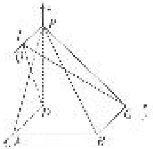

> [!faq]- 《专题10 利用空间向量计算线面角的问题-立体几何（理科）》例题解析
>
> > [!success]- **【答案】** 详见解析
>
> > [!note]- **【解析】**
> > 解析
> > (1)在正方形 $ABCD$ 中， $AD \parallel BC$ ，因为 $AD \nsubseteq$ 平面 $PBC$ ， $BC \subset$ 平面 $PBC$ ，所以 $AD \parallel$ 平面 $PBC$ ，又因为 $AD \subset$ 平面 $PAD$ ，平面 $PAD \cap$ 平面 $PBC = l$ ，所以 $AD \parallel l$ .
> >
> > 因为在四棱锥 P-ABCD 中，底面 ABCD 是正方形，所以 $AD \perp DC$ ，所以 $l \perp DC$ ，
> >
> > 又 $PD \perp$ 平面 ABCD，所以 $AD \perp PD$ ，所以 $l \perp PD$ 。因为 $DC \cap PD = D$ ，所以 $l \perp$ 平面 PDC。
> >
> > (2)如图建立空间直角坐标系 Dxyz,
> >
> > 
> >
> > 因为 $PD = AD = 1$ ，则有 $D(0,0,0),C(0,1,0),A(1,0,0),P(0,0,1),B(1,1,0)$ 设 $Q(m,0,1)$ ，则有 $\vec{DC} = (0,1,0),\vec{DQ} = (m,0,1),\vec{PB} = (1,1, - 1).$
> >
> > 设平面 QCD 的法向量为 $\boldsymbol{n}=(x,y,z)$ ，则 $\left\{\begin{aligned}\vec{D}C\cdot\boldsymbol{n}&=0,\\ \vec{D}Q\cdot\boldsymbol{n}&=0,\end{aligned}\right.$ 即 $\left\{\begin{aligned}y&=0,\\ mx+z&=0,\end{aligned}\right.$
> >
> > 令 x=1，则 z=-m，所以平面 QCD 的一个法向量为 $n=(1,0,-m)$ ,
> >
> > 则 $\cos<n,\quad\overrightarrow{PB}=\frac{\boldsymbol{n}\cdot\overrightarrow{PB}}{|\boldsymbol{n}||\overrightarrow{PB}|}=\frac{1+0+m}{\sqrt{3}\cdot\sqrt{m^{2}+1}}.$
> >
> > 根据直线的方向向量与平面法向量所成角的余弦值的绝对值即为直线与平面所成角的正弦值，所以直线与平面所成角的正弦值等于
> >
> > $$
> > | \cos <   n, \vec {P B} > | = \frac {| 1 + m |}{\sqrt {3} \cdot \sqrt {m ^ {2} + 1}} = \frac {\sqrt {3}}{3} \cdot \sqrt {\frac {1 + 2 m + m ^ {2}}{m ^ {2} + 1}} = \frac {\sqrt {3}}{3} \cdot \sqrt {1 + \frac {2 m}{m ^ {2} + 1}}
> > $$
> >
> > $\leqslant \frac{\sqrt{3}}{3}\cdot \sqrt{1 + \frac{2|m|}{m^2 + 1}}\leqslant \frac{\sqrt{3}}{3}\cdot \sqrt{1 + 1} = \frac{\sqrt{6}}{3}$ 当且仅当 $m = 1$ 时取等号，
> >
> > 所以直线 $PB$ 与平面 $QCD$ 所成角的正弦值的最大值为 $\frac{\sqrt{6}}{3}$ .
