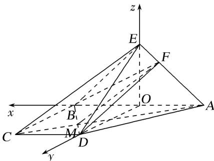

> [!faq]- 《专题10 利用空间向量计算线面角的问题-立体几何（理科）》例题解析
>
> > [!success]- **【答案】** 详见解析
>
> > [!note]- **【分析】**
> > 本题未单列分析。
>
> > [!note]- **【解析】**
> > 解析
> > (1) 当 $\lambda = \frac{1}{3}$ 时, $CE \parallel$ 平面 $FBD$ .
> >
> > 证明如下：连接 AC，交 BD 于点 M，连接 MF，
> >
> > 因为 $AB \parallel CD$ ，所以 $AM:MC=AB:CD=2:1$ 。又 $\overrightarrow{EF}=\frac{1}{3}\overrightarrow{EA}$ ，所以 $FA:EF=2:1$ 。
> >
> > 所以 AM:MC=AF:EF=2:1. 所以 MF//CE.
> >
> > 又 $MF \subset$ 平面 BDF， $CE \notin$ 平面 BDF，所以 CE // 平面 BDF.
> >
> > (2)取 $AB$ 的中点 $O$ , 连接 $EO, OD$ . 则 $EO \perp AB$ .
> >
> > 又因为平面 $ABE \perp$ 平面 ABCD，平面 $ABE \cap$ 平面 ABCD = AB， $EO \subset$ 平面 ABE，
> >
> > 所以 $EO \perp$ 平面 ABCD，因为 $OD \subset$ 平面 ABCD，所以 $EO \perp OD$ .
> >
> > 由 $BC \perp CD$ ，及 AB = 2CD， $AB \parallel CD$ ，得 $OD \perp AB$ ，
> >
> > 由 OB, OD, OE 两两垂直, 建立如图所示的空间直角坐标系 O-xyz.
> >
> > 
> >
> > 因为 $\triangle EAB$ 为等腰直角三角形， $AB=2BC=2CD$ ，所以 $OA=OB=OD=OE$ ，设 OB=1，所以 $O(0,0,0)$ ， $A(-1,0,0)$ ， $B(1,0,0)$ ， $C(1,1,0)$ ， $D(0,1,0)$ ， $E(0,0,1)$ .
> >
> > 所以 $\overrightarrow{AB}=(2,0,0)$ ， $\overrightarrow{BD}=(-1,1,0)$ ， $\overrightarrow{EA}=(-1,0,-1)$ ，
> >
> > $\overrightarrow{EF}=\frac{1}{3}\overrightarrow{EA}=\left(-\frac{1}{3},0,-\frac{1}{3}\right),F\left(-\frac{1}{3},0,\frac{2}{3}\right),所以\overrightarrow{FB}=\left(\frac{4}{3},0,-\frac{2}{3}\right).$
> >
> > 设平面 BDF 的法向量为 $\boldsymbol{n}=(x,y,z)$ ，则有 $\left\{\begin{aligned}\boldsymbol{n}\cdot\overrightarrow{B}\overrightarrow{D}&=0,\\ \boldsymbol{n}\cdot\overrightarrow{F}\overrightarrow{B}&=0,\end{aligned}\right.$ 所以 $\left\{\begin{aligned}-x+y&=0,\\ \frac{4}{3}x-\frac{2}{3}z&=0.\end{aligned}\right.$
> >
> > 取 x=1，得 $n=(1,1,2)$ .
> >
> > 设直线 $AB$ 与平面 $BDF$ 所成的角为 $\theta$ ，则 $\sin \theta = |\cos < \overrightarrow{AB}, n > | = \frac{|\overrightarrow{AB} \cdot n|}{|\overrightarrow{AB}||n|} = \frac{|2 \times 1 + 0 \times 1 + 0 \times 2|}{2\sqrt{1^2 + 1^2 + 2^2}} = \frac{\sqrt{6}}{6}$ .
> >
> > 故直线 AB 与平面 BDF 所成角的正弦值为 $\frac{\sqrt{6}}{6}$ .
