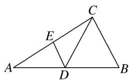
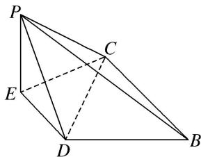

<!-- question-source:start -->
2. 在 $\triangle ABC$ 中, $D$ , $E$ 分别为 $AB$ , $AC$ 的中点, $AB = 2BC = 2CD$ , 如图①, 以 $DE$ 为折痕将 $\triangle ADE$ 折起,使点 $A$ 到达点 $P$ 的位置, 如图②.

(1)证明：平面 $BCP \perp$ 平面 $CEP$ ;

(2)若平面 $DEP \perp$ 平面 BCED，求直线 DP 与平面 BCP 所成角的正弦值.

  
图①

  
图②
<!-- question-source:end -->

![[高中/总复习/专题/立体几何/专题10 利用空间向量计算线面角的问题-立体几何（理科）/考点02_棱_圆_锥模型/对点训练/answers/Q00043665A1.md]]
