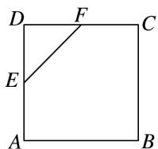
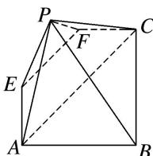

<!-- question-source:start -->
4. 如图 1, 在边长为 4 的正方形 $ABCD$ 中, $E$ 是 $AD$ 的中点, $F$ 是 $CD$ 的中点, 现将 $\triangle DEF$ 沿 $EF$ 翻折成如图 2 所示的五棱锥 $P-ABCFE$ .

(1)求证： $AC / /$ 平面PEF；

(2)若平面 $PEF \perp$ 平面 $ABCFE$ , 求直线 $PB$ 与平面 $PAE$ 所成角的正弦值.

  
图1

  
图2
<!-- question-source:end -->

![[高中/总复习/专题/立体几何/专题10 利用空间向量计算线面角的问题-立体几何（理科）/考点02_棱_圆_锥模型/对点训练/answers/Q00043667A1.md]]
