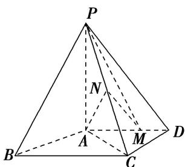

<!-- question-source:start -->
5. 如图，四棱锥 $P - ABCD$ 中， $PA \perp$ 底面 $ABCD, AD \parallel BC, AB = AD = AC = 3, PA = BC = 4, M$ 为线段 $AD$ 上一点， $AM = 2MD, N$ 为 $PC$ 的中点.

(1)证明： $MN / /$ 平面PAB；

(2)求直线 AN 与平面 PMN 所成角的正弦值.

<!-- question-source:end -->

![[高中/总复习/专题/立体几何/专题10 利用空间向量计算线面角的问题-立体几何（理科）/考点02_棱_圆_锥模型/对点训练/answers/Q00043668A1.md]]
