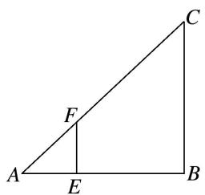
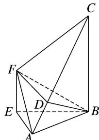

<!-- question-source:start -->
6. 如图①, 在 Rt△ABC 中, ∠B 为直角, AB = BC = 6, 点 E, F 分别为线段 AB, AC 上一点, 且 EF // BC, AE = 2, 沿 EF 将 △AEF 折起, 使 ∠AEB = $\frac{\pi}{3}$ , 得到如图②的几何体, 点 D 在线段 AC 上.

(1)求证：平面 $AEF \perp$ 平面 ABC;

(2)若 $AE \parallel$ 平面 $BDF$ , 求直线 $AF$ 与平面 $BDF$ 所成角的正弦值.

  
图①

  
图②
<!-- question-source:end -->

![[高中/总复习/专题/立体几何/专题10 利用空间向量计算线面角的问题-立体几何（理科）/考点02_棱_圆_锥模型/对点训练/answers/Q00043669A1.md]]
