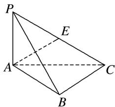
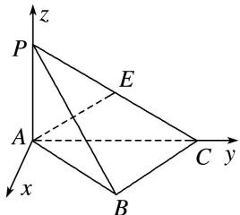

> [!faq]- 《专题10 利用空间向量计算线面角的问题-立体几何（理科）》例题解析
>
> > [!success]- **【答案】** 详见解析
>
> > [!note]- **【分析】**
> > 本题未单列分析。
>
> > [!note]- **【解析】**
> > (1)求证： $PA \perp BC;$
> > (2)设点 E 为 PC 的中点，求直线 AE 与平面 PBC 所成角的正弦值.
> > 
> > 1. 解析
> > (1) $AB = BC = 2, \angle ABC = 120^{\circ}$ , 由余弦定理得
> > $AC^{2} = AB^{2} + BC^{2} - 2AB\cdot BC\cdot \cos \angle ABC = 4 + 4 - 2\times 2\times 2\times \left(-\frac{1}{2}\right) = 12$ ，故 $AC = 2\sqrt{3}$
> > 又 $PA^{2}+AC^{2}=4+12=16=PC^{2}$ ，故 $PA\perp AC$ .
> > 又平面 PAC⊥平面 ABC，且平面 PAC∩平面 ABC=AC，故 PA⊥平面 ABC.
> > 又 $BC \subset$ 平面 $ABC$ ，故 $PA \perp BC$ .
> > (2)由
> > (1)知 $PA \perp$ 平面 ABC，故以 A 为坐标原点，建立如图所示的空间直角坐标系 A-xyz.
> > 
> > 则 $A(0, 0, 0)$ ， $B(1, \sqrt{3}, 0)$ ， $P(0, 0, 2)$ ， $C(0, 2\sqrt{3}, 0)$ ， $E(0, \sqrt{3}, 1)$ .
> > 故 $\overrightarrow{AE}=(0,\sqrt{3},1),\overrightarrow{PC}=(0,2\sqrt{3},-2),\overrightarrow{BC}=(-1,\sqrt{3},0)$ 设平面PBC的法向量 $m=(x,y,z)$ ，则 $\left\{\begin{aligned}\boldsymbol{m}\cdot\overrightarrow{PC}&=0,\\ \boldsymbol{m}\cdot\overrightarrow{BC}&=0,\end{aligned}\right.$ 即 $\left\{\begin{aligned}2\sqrt{3}y-2z&=0,\\ -x+\sqrt{3}y&=0,\end{aligned}\right.$ 令 y=1，有 $\left\{\begin{aligned}x=\sqrt{3},\\ y=1,\\ z=\sqrt{3},\end{aligned}\right.$ 故可取 $m=(\sqrt{3},1,\sqrt{3})$ ,
> > 设直线AE与平面PBC所成的角为θ，则 $\sin\theta=\frac{|\overrightarrow{AE}\cdot\boldsymbol{m}|}{|\overrightarrow{AE}\|m|}=\frac{2\sqrt{3}}{\sqrt{(\sqrt{3})^{2}+1^{2}}\sqrt{(\sqrt{3})^{2}+1^{2}+(\sqrt{3})^{2}}}=\frac{\sqrt{21}}{7}$ 所以直线AE与平面PBC所成角的正弦值为 $\frac{\sqrt{21}}{7}$ .
