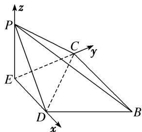

> [!faq]- 《专题10 利用空间向量计算线面角的问题-立体几何（理科）》例题解析
>
> > [!success]- **【答案】** 详见解析
>
> > [!note]- **【解析】**
> > 解析
> > (1)在题图①中，因为 $AB = 2BC = 2CD$ ，且 $D$ 为 $AB$ 的中点，所以由平面几何知识，得 $\angle ACB = 90^{\circ}$ 。又 $E$ 为 $AC$ 的中点，所以 $DE \parallel BC$ . 在题图②中， $CE \perp DE$ ， $PE \perp DE$ ，且 $CE \cap PE = E$ ，所以 $DE \perp$ 平面 $CEP$ ，所以 $BC \perp$ 平面 $CEP$ 又 $BC \subset$ 平面 $BCP$ ，所以平面 $BCP \perp$ 平面 $CEP$ .
> >
> > 
> >
> > (2)因为平面 $DEP \perp$ 平面 BCED，平面 $DEP \cap$ 平面 BCED = DE， $EP \subset$ 平面 DEP， $EP \perp DE$ ，
> >
> > 所以 $EP \perp$ 平面 BCED. 又 $CE \subset$ 平面 BCED, 所以 $EP \perp CE$ .
> >
> > 以 E 为坐标原点, $\overrightarrow{ED}, \overrightarrow{EC}, \overrightarrow{EP}$ 的方向分别为 x 轴, y 轴, z 轴的正方向建立如图所示的空间直角坐标系. 在题图①中，设 BC=2a，则 AB=4a， $AC=2\sqrt{3}a$ ， $AE=CE=\sqrt{3}a$ ，DE=a.
> >
> > $$
> > P (0, 0, \sqrt {3} a), D (a, 0, 0), C (0, \sqrt {3} a, 0), B (2 a, \sqrt {3} a, 0).
> > $$
> >
> > 所以 $\overrightarrow{DP} = (-a, 0, \sqrt{3} a), \overrightarrow{BC} = (-2a, 0, 0), \overrightarrow{CP} = (0, -\sqrt{3} a, \sqrt{3} a)$ .
> >
> > 设平面 $BCP$ 的法向量为 $\pmb {n} = (x,y,z)$ ，则 $\left\{ \begin{array}{l}n\cdot \overrightarrow{BC} = 0,\\ n\cdot \overrightarrow{CP} = 0, \end{array} \right.$ 即 $\left\{ \begin{array}{l} - 2ax = 0,\\ -\sqrt{3} ay + \sqrt{3} az = 0, \end{array} \right.$
> >
> > 令 y=1，则 z=1，所以 $n=(0,1,1)$ .
> >
> > 设 DP 与平面 BCP 所成的角为 $\theta$ ，则 $\sin\theta=|\cos<n,\quad\overrightarrow{DP}>|=\frac{|n\cdot\overrightarrow{DP}|}{|n||\overrightarrow{DP}|}=\frac{\sqrt{3}a}{\sqrt{2}\times2a}=\frac{\sqrt{6}}{4}.$
> >
> > 所以直线 DP 与平面 BCP 所成角的正弦值为 $\frac{\sqrt{6}}{4}$ .
