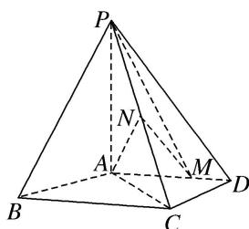
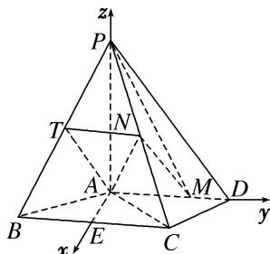

> [!faq]- 《专题10 利用空间向量计算线面角的问题-立体几何（理科）》例题解析
>
> > [!success]- **【答案】** 详见解析
>
> > [!note]- **【分析】**
> > 本题未单列分析。
>
> > [!note]- **【解析】**
> > (1)证明 $MN \parallel$ 平面 $PAB$ ;
> > (2)求直线 AN 与平面 PMN 所成角的正弦值.
> > 
> > 3. 解析
> > (1)由已知得 $AM=\frac{2}{3}AD=2$ . 取 BP 的中点 T, 连接 AT, TN,
> > 由 N 为 PC 的中点知 $TN \parallel BC$ ， $TN = \frac{1}{2} BC = 2$ 。又 $AD \parallel BC$ ，故 TN 级 AM，
> > 所以四边形 AMNT 为平行四边形，于是 MN // AT.
> > 因为 $MN \notin$ 平面 PAB， $AT \subset$ 平面 PAB，所以 $MN \parallel$ 平面 PAB.
> > 
> > (2)取 BC 的中点 E，连接 AE．由 AB=AC 得 $AE \perp BC$ ，从而 $AE \perp AD$ ，
> > 且 $AE = \sqrt{AB^2 - BE^2} = \sqrt{AB^2 - \left(\frac{BC}{2}\right)^2} = \sqrt{5}$ . 以 $A$ 为坐标原点， $\overrightarrow{AE}$ 的方向为 $x$ 轴正方向，建立如图所示的空间直角坐标系 A-xyz. 由题意知 $P(0,0,4)$ ， $M(0,2,0)$ ， $C(\sqrt{5},2,0)$ ， $N\left(\frac{\sqrt{5}}{2},1,2\right)$ ， $\overrightarrow{PM}=(0,2,-4)$ ， $\overrightarrow{PN}=\left(\frac{\sqrt{5}}{2},1,-2\right)$ ， $\overrightarrow{AN}=\left(\frac{\sqrt{5}}{2},1,2\right)$ .
> > 设 $n=(x,y,z)$ 为平面 PMN 的法向量，则 $\left\{\begin{aligned}&n\cdot\overrightarrow{PM}=0,\\ &n\cdot\overrightarrow{PN}=0,\end{aligned}\right.$ 即 $\left\{\begin{aligned}&2y-4z=0,\\ &\frac{\sqrt{5}}{2}x+y-2z=0,\end{aligned}\right.$ 可取 $n=(0,2,1)$ .
> > 于是 $|\cos<n,\quad\overrightarrow{AN}>|=\frac{|\boldsymbol{n}\cdot\overrightarrow{AN}|}{|\boldsymbol{n}||\overrightarrow{AN}|}=\frac{8\sqrt{5}}{25}$ . 所以直线 AN 与平面 PMN 所成角的正弦值为 $\frac{8\sqrt{5}}{25}$ .
