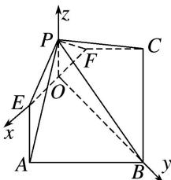

> [!faq]- 《专题10 利用空间向量计算线面角的问题-立体几何（理科）》例题解析
>
> > [!success]- **【答案】** 详见解析
>
> > [!note]- **【解析】**
> > 解析
> > (1)在题图1中, 连接 $AC$ . 又 $E$ , $F$ 分别为 $AD$ , $CD$ 的中点, 所以 $EF \parallel AC$ . 即题图2中有 $EF \parallel AC$ . 又 $EF \subset$ 平面 $PEF$ , $AC \nmid$ 平面 $PEF$ , 所以 $AC \parallel$ 平面 $PEF$ .
> >
> > (2)在题图2中, 取 $EF$ 的中点 $O$ , 并分别连接 $OP$ , $OB$ .
> >
> > 分析知, $OP \perp EF$ , $OB \perp EF$ . 又平面 $PEF \perp$ 平面 $ABCFE$ ,
> >
> > 平面 $PEF \cap$ 平面 $ABCFE = EF$ , $PO \subset$ 平面 $PEF$ , 所以 $PO \perp$ 平面 $ABCFE$ . 又 $AB = 4$ , 所以 $PF = AE = PE = 2$ , $EO = OP = OF = \sqrt{2}$ , $OB = 3\sqrt{2}$ .
> >
> > 分别以 $O$ 为原点, $OE$ , $OB$ , $OP$ 为 $x$ 轴, $y$ 轴, $z$ 轴建立如图所示的空间直角坐标系,
> >
> > 
> >
> > 则 $O(0, 0, 0)$ ， $P(0, 0, \sqrt{2})$ ， $B(0, 3\sqrt{2}, 0)$ ， $E(\sqrt{2}, 0, 0)$ ， $A(2\sqrt{2}, \sqrt{2}, 0)$ ，
> > 所以 $\overrightarrow{BP}=(0,-3\sqrt{2},\sqrt{2}),\overrightarrow{EA}=(\sqrt{2},\sqrt{2},0),\overrightarrow{EP}=(-\sqrt{2},0,\sqrt{2}).$ 设平面 PAE 的一个法向量 $\boldsymbol{n}=(x,y,z)$ ，则 $\left\{\begin{aligned}\sqrt{2}x+\sqrt{2}y=0,\\ -\sqrt{2}x+\sqrt{2}z=0,\end{aligned}\right.$ 取 x=1，则 y=-1，z=1，所以 $\boldsymbol{n}=(1,-1,1)$ .
> > 所以 $\cos<\overrightarrow{BP},\quad n>\frac{0\times1+(-3\sqrt{2})\times(-1)+\sqrt{2}\times1}{\sqrt{0^{2}+(-3\sqrt{2})^{2}+(\sqrt{2})^{2}}\times\sqrt{1^{2}+(-1)^{2}+1^{2}}}=\frac{2\sqrt{30}}{15}.$
> >
> > 分析知，直线 PB 与平面 PAE 所成角的正弦值为 $\frac{2\sqrt{30}}{15}$ .
