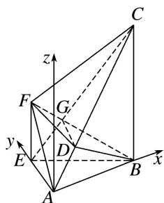
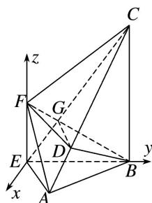

> [!faq]- 《专题10 利用空间向量计算线面角的问题-立体几何（理科）》例题解析
>
> > [!success]- **【答案】** 详见解析
>
> > [!note]- **【解析】**
> > 解析
> > (1)如题图②, 在 $\triangle ABE$ 中, $\because AE = 2$ , $BE = 4$ , $\angle AEB = \frac{\pi}{3}$ ,
> >
> > ∴由余弦定理得 $AB^{2}=AE^{2}+BE^{2}-2AE\cdot BE\cos\angle AEB=4+16-2\times2\times4\times\frac{1}{2}=12,\quad\therefore AB=2\sqrt{3}.$ ∴ $EB^{2}=EA^{2}+AB^{2},\quad\therefore \angle EAB=\frac{\pi}{2}$ ，即 $EA\perp AB,$ 又 $EF\perp EB,$ $EF\perp EA,$ $EA\cap EB=E,$ $EA,$ $EB\subset$ 平面 ABE，∴ $EF\perp$ 平面 ABE，∴ $EF\perp AB,$ 又 $EA\cap EF=E,$ $EA,$ $EF\subset$ 平面 AEF，∴ $AB\perp$ 平面 AEF，
> >
> > 又 $AB\subset$ 平面 ABC，∴ 平面 $AEF\perp$ 平面 ABC.
> >
> > (2)方法一 如图，以 A 为原点，以 AB 所在直线为 x 轴，AE 所在直线为 y 轴，过点 A 垂直于平面 ABE 的直线为 z 轴，建立空间直角坐标系，
> >
> > 
> >
> > 则 $A(0, 0, 0)$ ， $B(2\sqrt{3}, 0, 0)$ ， $F(0, 2, 2)$ ， $C(2\sqrt{3}, 0, 6)$ ，
> > ∴ $\overrightarrow{AF}=(0,2,2),\overrightarrow{FB}=(2\sqrt{3},-2,-2),\overrightarrow{AC}=(2\sqrt{3},0,6).$
> >
> > 连接 $EC$ 与 $FB$ 交于点 $G$ ，连接 $DG$ ， $\because AE \parallel$ 平面 $BDF$ ， $DG$ 为平面 $AEC$ 与平面 $BDF$ 的交线， $\therefore AE \parallel GD$ ， $\therefore \frac{GC}{GE} = \frac{DC}{DA}$ ，在四边形 $BCFE$ 中， $\because EF \parallel BC$ ， $\therefore \triangle EFG \sim \triangle CBG$ ， $\therefore \frac{GC}{GE} = \frac{BC}{EF} = 3$ ， $\therefore \frac{DC}{DA} = 3$ ， $\therefore \overrightarrow{AD} = \frac{1}{4} \overrightarrow{AC}$ ，
> >
> > 设 $D(x_{0}, y_{0}, z_{0})$ ，则 $\overrightarrow{AD} = (x_{0}, y_{0}, z_{0})$ ，由 $\overrightarrow{AD} = \frac{1}{4}\overrightarrow{AC}$ ，得 $\left\{\begin{aligned} x_{0} &= \frac{\sqrt{3}}{2}, \\ y_{0} &= 0, \\ z_{0} &= \frac{3}{2}, \end{aligned}\right.$ $\therefore D\left(\frac{\sqrt{3}}{2}, 0, \frac{3}{2}\right), \therefore \overrightarrow{FD} = \left(\frac{\sqrt{3}}{2}, -2, -\frac{1}{2}\right).$ 设平面 BDF 的一个法向量为 $n = (x, y, z)$ ，则 $\left\{\begin{aligned} n \cdot \overrightarrow{FD} &= \frac{\sqrt{3}}{2}x - 2y - \frac{1}{2}z = 0, \\ n \cdot \overrightarrow{FB} &= 2\sqrt{3}x - 2y - 2z = 0, \end{aligned}\right.$ 取 x = 1，则 $z = \sqrt{3}$ ，y = 0，∴ $n = (1, 0, \sqrt{3})$ ，
> >
> > 设直线 AF 与平面 BDF 所成的角为 $\theta$ ，则 $\sin \theta = \frac{|\overrightarrow{AF} \cdot n|}{|\overrightarrow{AF}| \cdot |n|} = \frac{2\sqrt{3}}{4\sqrt{2}} = \frac{\sqrt{6}}{4}.$ 即直线 AF 与平面 BDF 所成角的正弦值为 $\frac{\sqrt{6}}{4}$ .
> >
> > 方法二 如图，以 E 为原点，在平面 ABE 中过 E 作 EB 的垂线为 x 轴，EB 直线为 z 轴，建立空间直角坐标系，
> >
> > $$
> > E F
> > $$
> >
> > 
> >
> > 则 $E(0, 0, 0)$ ， $F(0, 0, 2)$ ， $B(0, 4, 0)$ ， $C(0, 4, 6)$ ， $A(\sqrt{3}, 1, 0)$ ，
> > ∴ $\overrightarrow{AF}=(-\sqrt{3}, -1, 2)$ ， $\overrightarrow{FB}=(0, 4, -2)$ ， $\overrightarrow{AC}=(-\sqrt{3}, 3, 6)$ .
> >
> > 连接 $EC$ 与 $FB$ 交于点 $G$ ，连接 $DG$ ， $\because AE \parallel$ 平面 $BDF$ ， $DG$ 为平面 $AEC$ 与平面 $BDF$ 的交线， $\therefore AE \parallel GD$ ， $\therefore \frac{GC}{GE} = \frac{DC}{DA}$ ，在四边形 $BCFE$ 中， $\because EF \parallel BC$ ， $\therefore \triangle EFG \sim \triangle CBG$ ， $\therefore \frac{GC}{GE} = \frac{BC}{EF} = 3$ ， $\therefore \frac{DC}{DA} = 3$ ， $\therefore \overrightarrow{AD} = \frac{1}{4} \overrightarrow{AC}$ ，
> >
> > 设 $D(x_0, y_0, z_0)$ ，则 $\overrightarrow{AD} = (x_0 - \sqrt{3}, y_0 - 1, z_0)$ ，由 $\overrightarrow{AD} = \frac{1}{4}\overrightarrow{AC}$ ，得 $\begin{cases} x_0 - \sqrt{3} = -\frac{\sqrt{3}}{4}, \\ y_0 - 1 = \frac{3}{4}, \\ z_0 = \frac{3}{2}, \end{cases}$ 解得 $\left\{ \begin{array}{l} x_0 = \frac{3\sqrt{3}}{4}, \\ y_0 = \frac{7}{4}, \\ z_0 = \frac{3}{2}, \end{array} \right.$ $\therefore D\left(\frac{3\sqrt{3}}{4}, \frac{7}{4}, \frac{3}{2}\right), \therefore \overrightarrow{FD} = \left(\frac{3\sqrt{3}}{4}, \frac{7}{4}, -\frac{1}{2}\right).$ 设平面 $BDF$ 的法向量为 $n = (x, y, z)$ ，则 $\left\{ \begin{array}{l} n \cdot \overrightarrow{FD} = \frac{3\sqrt{3}}{4} x + \frac{7}{4} y - \frac{1}{2} z = 0, \\ n \cdot \overrightarrow{FB} = 4y - 2z = 0, \end{array} \right.$ 取 $y = 1$ ，则 $z = 2, x = -\frac{\sqrt{3}}{3}, \therefore n = \left(-\frac{\sqrt{3}}{3}, 1, 2\right)$ ，设直线 $AF$ 与平面 $BDF$ 所成的角为 $\theta$ ，则 $\sin \theta = \frac{|\overrightarrow{AF} \cdot n|}{|\overrightarrow{AF}| \cdot |n|} = \frac{4}{\sqrt{8} \times \sqrt{\frac{16}{3}}} = \frac{\sqrt{6}}{4}$ . 直线 $AF$ 与平面 $BDF$ 所成角的正弦值为 $\frac{\sqrt{6}}{4}$ .
