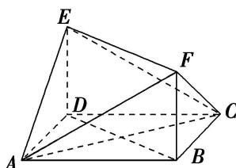
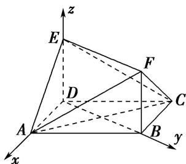

<!-- question-source:start -->
[例 1] 在如图所示的多面体中, 四边形 ABCD 是平行四边形, 四边形 BDEF 是矩形, $ED \perp$ 平面 ABCD, $\angle ABD = \frac{\pi}{6}$ , AB = 2AD.

(1)求证：平面 BDEF⊥平面 ADE;

(2)若 $ED = BD$ ，求直线 $AF$ 与平面 $AEC$ 所成角的正弦值.

(1)在 $\triangle ABD$ 中， $\angle ABD=\frac{\pi}{6}$ ， $AB=2AD$ ，由余弦定理，得 $BD=\sqrt{3}AD$ ，

从而 $BD^{2}+AD^{2}=AB^{2}$ ，故 $BD\perp AD$ ，所以 $\triangle ABD$ 为直角三角形且 $\angle ADB=\frac{\pi}{2}$ .

因为 $DE \perp$ 平面 $ABCD, BD \subset$ 平面 $ABCD$ , 所以 $DE \perp BD$ . 又 $AD \cap DE = D$ , 所以 $BD \perp$ 平面 $ADE$ . 因为 $BD \subset$ 平面 $BDEF$ , 所以平面 $BDEF \perp$ 平面 $ADE$ .

(2)由
(1)可得，在 Rt△ABD 中，∠BAD= $\frac{\pi}{3}$ ，BD= $\sqrt{3}$ AD，又由 ED=BD，设 AD=1，则 BD=ED= $\sqrt{3}$ .

因为 $DE \perp$ 平面 ABCD， $BD \perp AD$ ，所以以点 D 为坐标原点，DA，DB，DE 所在直线分别为 x 轴，y 轴，z 轴建立空间直角坐标系，如图所示．则 $A(1,0,0)$ ， $C(-1,\sqrt{3},0)$ ， $E(0,0,\sqrt{3})$ ， $F(0,\sqrt{3},\sqrt{3})$ ，

所以 $\overrightarrow{AE} = (-1, 0, \sqrt{3})$ , $\overrightarrow{AC} = (-2, \sqrt{3}, 0)$ .

设平面 AEC 的法向量为 $\boldsymbol{n}=(x,y,z)$ ，则 $\left\{\begin{aligned}\boldsymbol{n}\cdot\overrightarrow{AE}&=0,\\ \boldsymbol{n}\cdot\overrightarrow{AC}&=0,\end{aligned}\right.$ 即 $\left\{\begin{aligned}-x+\sqrt{3}z&=0,\\ -2x+\sqrt{3}y&=0,\end{aligned}\right.$

令 z=1，得 $n=(\sqrt{3},2,1)$ 为平面 AEC 的一个法向量.

因为 $\overrightarrow{AF} = (-1, \sqrt{3}, \sqrt{3})$ ，所以 $\cos < n$ ， $\overrightarrow{AF} > = \frac{n \cdot \overrightarrow{AF}}{|n| \cdot |\overrightarrow{AF}|} = \frac{\sqrt{42}}{14}$ ，

所以直线 AF 与平面 AEC 所成角的正弦值为 $\frac{\sqrt{42}}{14}$ .
<!-- question-source:end -->

![[高中/总复习/专题/立体几何/专题10 利用空间向量计算线面角的问题-立体几何（理科）/考点03_不规则几何体模型/例题/answers/Q00043670A1.md]]
