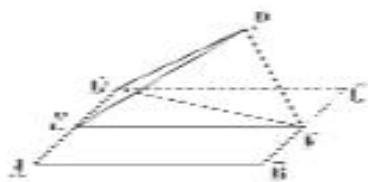

<!-- question-source:start -->
[例 2] (2018·全国 I) 如图，四边形 ABCD 为正方形，E, F 分别为 AD, BC 的中点，以 DF 为折痕把 $\triangle DFC$ 折起，使点 C 到达点 P 的位置，且 $PF \perp BF$ .

(1)证明：平面 $PEF \perp$ 平面ABFD;

(2)求 $DP$ 与平面ABFD所成角的正弦值.

<!-- question-source:end -->

![[高中/总复习/专题/立体几何/专题10 利用空间向量计算线面角的问题-立体几何（理科）/考点03_不规则几何体模型/例题/answers/Q00043671A1.md]]
