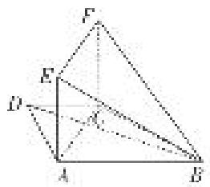

<!-- question-source:start -->
[例3] 如图，在梯形 $ABCD$ 中， $AB \parallel CD$ ， $AD = CD = CB = 2$ ， $\angle ABC = 60^\circ$ ，矩形 $ACFE$ 中， $AE = 2$ ，又有 $BF = 2\sqrt{2}$ .

(1)求证： $BC \perp$ 平面 ACFE;

(2)求直线 BD 与平面 BEF 所成角的正弦值.

<!-- question-source:end -->

![[高中/总复习/专题/立体几何/专题10 利用空间向量计算线面角的问题-立体几何（理科）/考点03_不规则几何体模型/例题/answers/Q00043672A1.md]]
