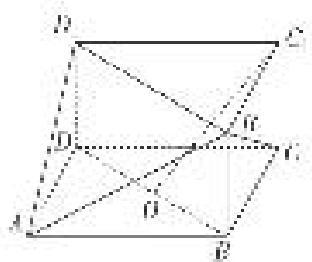

<!-- question-source:start -->
(1)设 O 是线段 BD 的中点，求证： $C_{1}O \parallel$ 平面 $AB_{1}D_{1}$ ;

(2)求直线 $B_{1}C$ 与平面 $AB_{1}D_{1}$ 所成角的正弦值.

<!-- question-source:end -->

![[高中/总复习/专题/立体几何/专题10 利用空间向量计算线面角的问题-立体几何（理科）/考点03_不规则几何体模型/例题/answers/Q00043673A1.md]]
