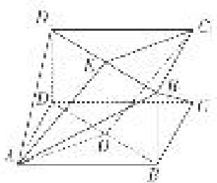

<!-- question-source:start -->
(1)取 $B_{1}D_{1}$ 的中点为 $E$ ，连接 $C_1E$ ，OA，AE，易知 $C_1E = OA$ 且 $C_1E \parallel OA$ 所以四边形 $C_1EAO$ 为平行四边形，所以 $C_1O \parallel EA$

又 $C_{1}O \not\subset$ 平面 $AB_{1}D_{1}$ ， $AE \subset$ 平面 $AB_{1}D_{1}$ ，所以 $C_{1}O \parallel$ 平面 $AB_{1}D_{1}$ .

(2)
<!-- question-source:end -->

![[高中/总复习/专题/立体几何/专题10 利用空间向量计算线面角的问题-立体几何（理科）/考点03_不规则几何体模型/例题/answers/Q00043674A1.md]]
