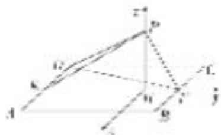

> [!faq]- 《专题10 利用空间向量计算线面角的问题-立体几何（理科）》例题解析
>
> > [!success]- **【答案】** 详见解析
>
> > [!note]- **【分析】**
> > 本题未单列分析。
>
> > [!note]- **【解析】**
> > 解析
> > (1)证明：由已知可得， $BF \perp PF$ ， $BF \perp EF$ ，
> >
> > 又 $PF \cap EF = F$ ，所以 $BF \perp$ 平面 PEF。又 $BF \subset$ 平面 ABFD，所以平面 $PEF \perp$ 平面 ABFD。
> >
> > (2)作 $PH \perp EF$ ，垂足为 $H$ 。由
> > (1)，得 $PH \perp$ 平面 $ABFD$ .
> >
> > 以 H 为坐标原点， $\overrightarrow{HF}$ 的方向为 y 轴正方向， $|\overrightarrow{BF}|$ 为单位长，建立如图所示的空间直角坐标系 Hxyz.
> >
> > 
> >
> > 由
> > (1)可得， $DE \perp PE$ ．又 DP=2，DE=1，所以 $PE=\sqrt{3}$ ．又 PF=1，EF=2，故 $PE \perp PF$ ．
> >
> > 所以 $PH=\frac{\sqrt{3}}{2}$ ， $EH=\frac{3}{2}$ ，则 $H(0,0,0)$ ， $P\left(0,0,\frac{\sqrt{3}}{2}\right)$ ， $D\left(-1,-\frac{3}{2},0\right)$
> >
> > 所以 $\vec{DP} = \left(1, \frac{3}{2}, \frac{\sqrt{3}}{2}\right)$ , $\vec{HP} = \left(0, 0, \frac{\sqrt{3}}{2}\right)$ , $H\vec{P}$ 为平面 $ABFD$ 的法向量.
> >
> > 设 DP 与平面 ABFD 所成的角为 $\theta$ ,
> >
> > 则 $\sin\theta=\frac{|\vec{HP}\cdot\vec{DP}|}{|\vec{HP}||\vec{DP}|}=\frac{\frac{3}{4}}{\sqrt{3}}=\frac{\sqrt{3}}{4}$ . 所以 DP 与平面 ABFD 所成角的正弦值为 $\frac{\sqrt{3}}{4}$ .
