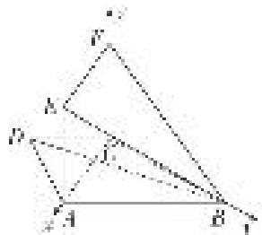

> [!faq]- 《专题10 利用空间向量计算线面角的问题-立体几何（理科）》例题解析
>
> > [!success]- **【答案】** C
>
> > [!note]- **【解析】**
> > 解析
> > (1)在梯形 $ABCD$ 中， $AB \parallel CD$ ， $AD = CD = CB = 2$ ， $\angle ABC = 60^{\circ}$ ，
> >
> > ∴四边形 ABCD 是等腰梯形， $\angle ADC=120^{\circ}$ ， $\therefore\angle DCA=\angle DAC=30^{\circ}$ ， $\angle DCB=120^{\circ}$ ， $\therefore\angle ACB=\angle DCB-\angle DCA=90^{\circ}$ ， $\therefore AC\perp BC$ ，(也可以利用余弦定理求出AC再证明)
> > ∵在矩形ACFE中，CF=AE=2，又 $BF=2\sqrt{2}$ ，CB=2， $\therefore CB\perp CF$ 又 $AC \cap CF = C$ ， $\therefore BC \perp$ 平面 ACFE.
> >
> > 
> >
> > (2)以点 C 为坐标原点，以 CA 所在直线为 x 轴，CB 所在直线为 y 轴，CF 所在直线为 z 轴，
> >
> > 建立空间直角坐标系．可得 $C(0, 0, 0)$ ， $B(0, 2, 0)$ ， $F(0, 0, 2)$ ， $D(\sqrt{3}, -1, 0)$ ， $E(2\sqrt{3}, 0, 2)$ ，
> > ∴ $\overrightarrow{EF}=(-2\sqrt{3},0,0)$ ， $\overrightarrow{BF}=(0,-2,2)$ ， $\overrightarrow{BD}=(\sqrt{3},-3,0)$ .
> >
> > 设平面 BEF 的法向量为 $\boldsymbol{n}=(x,y,z)$ ，则 $\left\{\begin{aligned}\boldsymbol{n}\cdot\overrightarrow{EF}&=0,\\ \boldsymbol{n}\cdot\overrightarrow{BF}&=0,\end{aligned}\right.$ $\therefore\left\{\begin{aligned}-2\sqrt{3}x&=0,\\ -2y+2z&=0,\end{aligned}\right.$
> >
> > 令 y=1，则 x=0, z=1，∴ $n=(0,1,1)$ ,
> >
> > $$
> > \therefore | \cos <   \overrightarrow {B D}, n > | = \left| \frac {\overrightarrow {B D} \cdot \boldsymbol {n}}{| \overrightarrow {B D} | | \boldsymbol {n} |} \right| = \frac {\sqrt {6}}{4},
> > $$
> >
> > ∴直线 BD 与平面 BEF 所成角的正弦值是 $\frac{\sqrt{6}}{4}$ .
> >
> > [例 4] 如图所示，在三棱柱 $BCD - B_{1}C_{1}D_{1}$ 与四棱锥 $A - BB_{1}D_{1}D$ 的组合体中，已知 $BB_{1} \perp$ 平面 BCD，四边形 ABCD 是菱形， $\angle BCD = 60^{\circ}$ ，AB = 2， $BB_{1} = 1$ .
