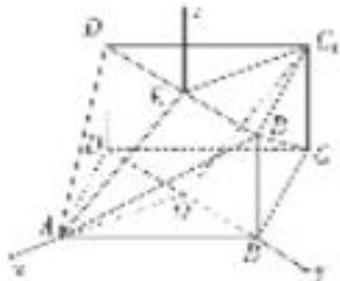

> [!faq]- 《专题10 利用空间向量计算线面角的问题-立体几何（理科）》例题解析
>
> > [!success]- **【答案】** 详见解析
>
> > [!note]- **【分析】**
> > 本题未单列分析。
>
> > [!note]- **【解析】**
> > 解法二：如图所示，以 O 为坐标原点，OA，OB，OE 所在的直线分别为 x，y，z 轴，
> >
> > 建立空间直角坐标系 Oxyz，得 $A(\sqrt{3}, 0, 0)$ ， $B_{1}(0, 1, 1)$ ， $D_{1}(0, -1, 1)$ ， $C(-\sqrt{3}, 0, 0)$ ，
> >
> > 
> >
> > 所以 $\overrightarrow{AB_{1}}=(-\sqrt{3},1,1)$ ， $\overrightarrow{D_{1}B_{1}}=(0,2,0)$ ， $\overrightarrow{B_{1}C}=(-\sqrt{3},-1,-1)$
> >
> > 设平面 $AB_{1}D_{1}$ 的一个法向量为 $\boldsymbol{n}=(x,y,z)$ ，则 $\left\{\begin{aligned}\boldsymbol{n}\cdot\overrightarrow{AB_{1}}=0,\\ \boldsymbol{n}\cdot D_{1}\overrightarrow{B_{1}}=0,\end{aligned}\right.$ 得 $\left\{\begin{aligned}-\sqrt{3}x+y+z=0,\\ 2y=0,\end{aligned}\right.$
> >
> > 令 x=1，有 y=0， $z=\sqrt{3}$ ，所以 $n=(1,0,\sqrt{3})$ .
> >
> > 记 $\alpha$ 为直线 $B_{1}C$ 与平面 $AB_{1}D_{1}$ 所成的角，则 $\sin \alpha = \frac{|\pmb{n} \cdot \vec{B_1C}|}{|\pmb{n}||\vec{B_1C}|} = \frac{\sqrt{15}}{5}$ .
> >
> > ## 【对点训练】
