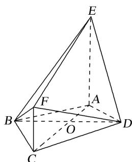

<!-- question-source:start -->
2. 如图，七面体 $ABCDEF$ 的底面是凸四边形 $ABCD$ ，其中 $AB = AD = 2$ ， $\angle BAD = 120^\circ$ ， $AC$ ， $BD$ 互相垂直并相交于点 $O$ ， $OC = 2OA$ ，棱 $AE$ ， $CF$ 均垂直于底面 $ABCD$ ，且 $AE = 2CF$ .

(1)证明：直线 DE 与平面 BCF 不平行；

(2)若 $CF = 1$ ，求直线 $BC$ 与平面 $BFD$ 所成角的正弦值.

<!-- question-source:end -->

![[高中/总复习/专题/立体几何/专题10 利用空间向量计算线面角的问题-立体几何（理科）/考点03_不规则几何体模型/对点训练/answers/Q00043676A1.md]]
