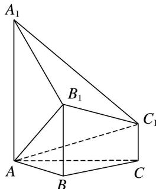
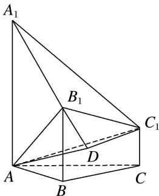
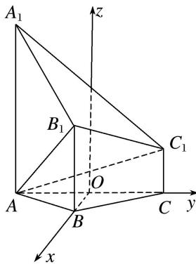

> [!faq]- 《专题10 利用空间向量计算线面角的问题-立体几何（理科）》例题解析
>
> > [!success]- **【答案】** 详见解析
>
> > [!note]- **【分析】**
> > 本题未单列分析。
>
> > [!note]- **【解析】**
> > (1)证明： $AB_{1} \perp$ 平面 $A_{1}B_{1}C_{1}$ ;
> > (2)求直线 $AC_{1}$ 与平面 $ABB_{1}$ 所成的角的正弦值.
> > 
> > 1. 解析 方法一 (1)由 $AB = 2, AA_{1} = 4, BB_{1} = 2, AA_{1} \perp AB, BB_{1} \perp AB$ ，得 $AB_{1} = A_{1}B_{1} = 2\sqrt{2}$ ，所以 $A_{1}B_{1}^{2} + AB_{1}^{2} = AA_{1}^{2}$ ，故 $AB_{1} \perp A_{1}B_{1}$ 。由 $BC = 2, BB_{1} = 2, CC_{1} = 1, BB_{1} \perp BC, CC_{1} \perp BC$ ，得 $B_{1}C_{1} = \sqrt{5}$ 。由 $AB = BC = 2, \angle ABC = 120^{\circ}$ ，得 $AC = 2\sqrt{3}$ 。由 $CC_{1} \perp AC$ ，得 $AC_{1} = \sqrt{13}$ ，所以 $AB_{1}^{2} + B_{1}C_{1}^{2} = AC_{1}^{2}$ ，故 $AB_{1} \perp B_{1}C_{1}$ 。又因为 $A_{1}B_{1} \cap B_{1}C_{1} = B_{1}, A_{1}B_{1}, B_{1}C_{1} \subset$ 平面 $A_{1}B_{1}C_{1}$ ，所以 $AB_{1} \perp$ 平面 $A_{1}B_{1}C_{1}$ 。(2)如图，过点 $C_{1}$ 作 $C_{1}D \perp A_{1}B_{1}$ ，交直线 $A_{1}B_{1}$ 于点 $D$ ，连接 $AD$ .
> > 
> > 由 $AB_{1} \perp$ 平面 $A_{1}B_{1}C_{1}$ ，得平面 $A_{1}B_{1}C_{1} \perp$ 平面 $ABB_{1}$ .
> > 由 $C_{1}D \perp A_{1}B_{1}$ ，平面 $A_{1}B_{1}C_{1} \cap$ 平面 $ABB_{1} = A_{1}B_{1}$ ， $C_{1}D \subset$ 平面 $A_{1}B_{1}C_{1}$ ，得 $C_{1}D \perp$ 平面 $ABB_{1}$ .
> > 所以 $\angle C_{1}AD$ 即为 $AC_{1}$ 与平面 $ABB_{1}$ 所成的角.
> > 由 $B_{1}C_{1} = \sqrt{5}$ ， $A_{1}B_{1} = 2\sqrt{2}$ ， $A_{1}C_{1} = \sqrt{21}$ ，得 $\cos \angle C_1A_1B_1 = \frac{\sqrt{42}}{7}$ ， $\sin \angle C_1A_1B_1 = \frac{\sqrt{7}}{7}$ ，所以 $C_1D = \sqrt{3}$
> > 故 $\sin \angle C_1AD = \frac{C_1D}{AC_1} = \frac{\sqrt{39}}{13}$ . 因此直线 $AC_{1}$ 与平面 $ABB_{1}$ 所成的角的正弦值是 $\frac{\sqrt{39}}{13}$ .
> > 方法二 (1)如图，以 $AC$ 的中点 $O$ 为原点，分别以射线 $OB$ ， $OC$ 为 $x$ ， $y$ 轴的正半轴，建立空间直角坐标系 $Oxyz$ .
> > 
> > 由题意知各点坐标如下： $A(0, -\sqrt{3}, 0)$ ， $B(1, 0, 0)$ ， $A_{1}(0, -\sqrt{3}, 4)$ ， $B_{1}(1, 0, 2)$ ， $C_{1}(0, \sqrt{3}, 1)$ .
> > 因此 $\overrightarrow{AB_{1}}=(1,\sqrt{3},2)$ ， $\overrightarrow{A_{1}B_{1}}=(1,\sqrt{3},-2)$ ， $\overrightarrow{A_{1}C_{1}}=(0,2\sqrt{3},-3)$ .
> > 由 $\overrightarrow{AB_{1}}\cdot\overrightarrow{A_{1}B_{1}}=0$ ，得 $AB_{1}\perp A_{1}B_{1}$ 。由 $\overrightarrow{AB_{1}}\cdot\overrightarrow{A_{1}C_{1}}=0$ ，得 $AB_{1}\perp A_{1}C_{1}$ .
> > 又 $A_{1}B_{1}\cap A_{1}C_{1}=A_{1}$ ， $A_{1}B_{1}$ ， $A_{1}C_{1}\subset$ 平面 $A_{1}B_{1}C_{1}$ ，所以 $AB_{1}\perp$ 平面 $A_{1}B_{1}C_{1}$ .
> > (2)设直线 $AC_{1}$ 与平面 $ABB_{1}$ 所成的角为 $\theta$ 。由(1)可知 $\overrightarrow{AC_{1}}=(0,2\sqrt{3},1),\overrightarrow{AB}=(1,\sqrt{3},0),\overrightarrow{BB_{1}}=(0,0,2).$ 设平面 $ABB_{1}$ 的一个法向量为 $n=(x,y,z)$ 。由 $\left\{\begin{aligned}&n\cdot\overrightarrow{AB}=0,\\ &n\cdot\overrightarrow{BB_{1}}=0,\end{aligned}\right.$ 得 $\left\{\begin{aligned}&x+\sqrt{3}y=0,\\ &2z=0,\end{aligned}\right.$ 可取 $n=(-\sqrt{3},1,0)$ .
> > 所以 $\sin\theta=|\cos\langle\overrightarrow{AC_{1}},n\rangle|=\frac{|\overrightarrow{AC_{1}}\cdot n|}{|\overrightarrow{AC_{1}}||n|}=\frac{\sqrt{39}}{13}.$ 因此直线 $AC_{1}$ 与平面 $ABB_{1}$ 所成的角的正弦值是 $\frac{\sqrt{39}}{13}$ .
