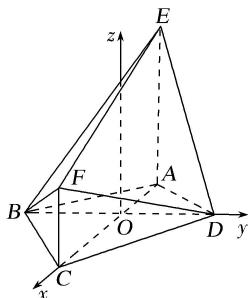

> [!faq]- 《专题10 利用空间向量计算线面角的问题-立体几何（理科）》例题解析
>
> > [!success]- **【答案】** 详见解析
>
> > [!note]- **【解析】**
> > 解析
> > (1)假设 $DE \parallel$ 平面 $BFC$ ，因为 $AE \parallel CF$ ， $AE \nsubseteq$ 平面 $BFC$ ， $CF \subset$ 平面 $BFC$ ，所以 $AE \parallel$ 平面 $BFC$ ，又因为 $DE \parallel$ 平面 $BFC$ ， $AE \cap DE = E$ ， $AE$ ， $DE \subset$ 平面 $ADE$ ，所以平面 $ADE \parallel$ 平面 $BFC$ ，根据面面平行的性质定理可得 $AD \parallel BC$ ，所以 $\frac{BO}{OD} = \frac{CO}{OA}$ .
> >
> > 因为 AB=AD， $AO \perp BD$ ，所以 BO=OD，CO=OA，这与 OC=2OA 矛盾，所以 DE 与平面 BFC 不平行.
> >
> > (2)以 O 为坐标原点，建立如图所示的空间直角坐标系，
> >
> > 
> >
> > 则 $B(0, -\sqrt{3}, 0)$ ， $C(2, 0, 0)$ ， $D(0, \sqrt{3}, 0)$ ， $E(-1, 0, 2)$ ， $F(2, 0, 1)$ ，
> > 所以 $\overrightarrow{BC}=(2,\sqrt{3},0),\overrightarrow{DB}=(0,-2\sqrt{3},0),\overrightarrow{DF}=(2,-\sqrt{3},1).$
> >
> > 设平面 BFD 的法向量 $\boldsymbol{n}=(x,y,z)$ ，由 $\left\{\begin{aligned}\overrightarrow{DB}\cdot\boldsymbol{n}&=0,\\ \overrightarrow{DF}\cdot\boldsymbol{n}&=0,\end{aligned}\right.$ 可得 $\left\{\begin{aligned}-2\sqrt{3}y&=0,\\ 2x-\sqrt{3}y+z&=0,\end{aligned}\right.$
> >
> > 则 $y = 0$ ，取 $x = 1$ ，得 $z = -2$
> >
> > 所以平面 BFD 的一个法向量 $\boldsymbol{n}=(1,0,-2)$ .
> >
> > 所以直线 BC 与平面 BFD 所成的角的正弦值为 $\sin\theta=\frac{|\overrightarrow{BC}\cdot\boldsymbol{n}|}{|\overrightarrow{BC}||\boldsymbol{n}|}=\frac{2\sqrt{35}}{35}$ .
