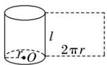
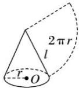
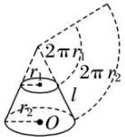

<!-- source-part:1 pages:1-41 -->

## 专题10 立体几何中的面积与体积问题

## 1. 多面体的表面积、侧面积

因为多面体的各个面都是平面，所以多面体的侧面积就是所有侧面的面积之和，表面积是侧面积与底面面积之和.

## 2. 圆柱、圆锥、圆台的侧面展开图及侧面积公式

<table><tr><td></td><td>圆柱</td><td>圆锥</td><td>圆台</td></tr><tr><td>侧面展开图</td><td></td><td></td><td></td></tr><tr><td>侧面积公式</td><td> $S_{\text{圆柱侧}}=2\pi rl$ </td><td> $S_{\text{圆锥侧}}=\pi rl$ </td><td> $S_{\text{圆台侧}}=\pi(r_1+r_2)l$ </td></tr></table>

## 3. 柱、锥、台、球的表面积和体积

<table><tr><td>几何体\名称</td><td>表面积</td><td>体积</td></tr><tr><td>柱体(棱柱和圆柱)</td><td> $S_{\text{表面积}} = S_{\text{侧}} + 2S_{\text{底}}$ </td><td> $V = Sh$ </td></tr><tr><td>锥体(棱锥和圆锥)</td><td> $S_{\text{表面积}} = S_{\text{侧}} + S_{\text{底}}$ </td><td> $V = \frac{1}{3}Sh$ </td></tr><tr><td>台体(棱台和圆台)</td><td> $S_{\text{表面积}} = S_{\text{侧}} + S_{\text{上}} + S_{\text{下}}$ </td><td> $V = \frac{1}{3}(S_{\text{上}} + S_{\text{下}} + \sqrt{S_{\text{上}}S_{\text{下}}})h$ </td></tr><tr><td>球</td><td> $S = 4\pi R^{2}$ </td><td> $V = \frac{4}{3}\pi R^{3}$ </td></tr></table>

![[高中/总复习/专题/立体几何/专题10 立体几何中的面积与体积问题-立体几何（文科）/考点01_几何体的面积问题/考点01_几何体的面积问题.md]]
![[高中/总复习/专题/立体几何/专题10 立体几何中的面积与体积问题-立体几何（文科）/考点02_几何体的体积问题/考点02_几何体的体积问题.md]]
