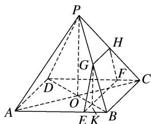

<!-- question-source:start -->
[例 1](2014·安徽)如图，四棱锥 P-ABCD 的底面是边长为 8 的正方形，四条侧棱长均为 $2\sqrt{17}$ . 点 G, E, F, H 分别是棱 PB, AB, CD, PC 上共面的四点，平面 GEFH⊥平面 ABCD, BC∥平面 GEFH.

(1)证明： $GH \parallel EF;$

(2)若 $EB = 2$ ，求四边形GEFH的面积.

(1)因为 $BC \parallel$ 平面 $GEFH$ , $BC \subset$ 平面 $PBC$ , 且平面 $PBC \cap$ 平面 $GEFH = GH$ , 所以 $GH \parallel BC$ . 同理可证 $EF \parallel BC$ , 因此 $GH \parallel EF$ .

(2)如图，连接 AC，BD 交于点 O，BD 交 EF 于点 K，连接 OP，GK.

因为 PA=PC，O 是 AC 的中点，所以 $PO \perp AC$ ，同理可得 $PO \perp BD$ .

又 $BD \cap AC = O$ ，且 $AC, BD \subset$ 底面 $ABCD$ ，所以 $PO \perp$ 底面 $ABCD$ .

又因为平面 $GEFH \perp$ 平面 $ABCD$ ，且 $PO \notin$ 平面 $GEFH$ ，所以 $PO //$ 平面 $GEFH$ .

因为平面 $PBD \cap$ 平面 GEFH = GK，所以 PO // GK，且 $GK \perp$ 底面 ABCD，从而 $GK \perp EF$ .

所以 GK 是梯形 GEFH 的高．由 AB=8，EB=2 得 EB:AB=KB:DB=1:4，

从而 $KB = \frac{1}{4} DB = \frac{1}{2} OB$ ，即 $K$ 为 $OB$ 的中点．再由 $PO / / GK$ 得 $GK = \frac{1}{2} PO$

即 $G$ 是 $PB$ 的中点，且 $GH = \frac{1}{2} BC = 4$ 。由已知可得 $OB = 4\sqrt{2}$ ，

$PO=\sqrt{PB^{2}-OB^{2}}=\sqrt{68-32}=6$ ，所以 GK=3。

故四边形 GEFH 的面积 $S=\frac{GH+EF}{2}\cdot GK=\frac{4+8}{2}\times3=18$ .
<!-- question-source:end -->

![[高中/总复习/专题/立体几何/专题10 立体几何中的面积与体积问题-立体几何（文科）/考点01_几何体的面积问题/例题/answers/Q00043677A1.md]]
