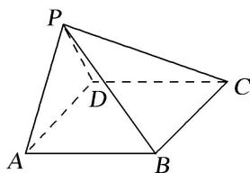

<!-- question-source:start -->
[例 2] (2017·全国 I) 如图，在四棱锥 P-ABCD 中， $AB \parallel CD$ ，且 $\angle BAP = \angle CDP = 90^{\circ}$ .

(1)证明：平面 $PAB \perp$ 平面 $PAD$ ;

(2)若 $PA = PD = AB = DC$ ， $\angle APD = 90^{\circ}$ ，且四棱锥 $P - ABCD$ 的体积为 $\frac{8}{3}$ ，求该四棱锥的侧面积.

<!-- question-source:end -->

![[高中/总复习/专题/立体几何/专题10 立体几何中的面积与体积问题-立体几何（文科）/考点01_几何体的面积问题/例题/answers/Q00043678A1.md]]
