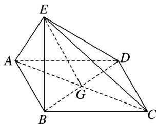

<!-- question-source:start -->
[例 4]如图，四边形 ABCD 为菱形，G 为 AC 与 BD 的交点， $BE \perp$ 平面 ABCD.

(1)证明：平面 $AEC \perp$ 平面 $BED$ ;

(2)若 $\angle ABC = 120^{\circ}$ ， $AE\bot EC$ ，三棱锥 $E - ACD$ 的体积为 $\frac{\sqrt{6}}{3}$ ，求该三棱锥的侧面积.

(1)因为四边形 ABCD 为菱形，所以 $AC \perp BD$ .

因为 $BE \perp$ 平面 ABCD， $AC \subset$ 平面 ABCD，所以 $BE \perp AC$ .

而 $BD \cap BE = B$ ，BD，BE ⊂ 平面 BED，所以 $AC \perp$ 平面 BED.

又 $AC \subset$ 平面 AEC，所以平面 $AEC \perp$ 平面 BED.

(2)设 $AB = x$ ，在菱形ABCD中，由 $\angle ABC = 120^{\circ}$ ，可得 $AG = GC = \frac{\sqrt{3}}{2} x$ ， $GB = GD = \frac{x}{2}$

因为 $AE \perp EC$ ，所以在 Rt△AEC 中，可得 $EG = \frac{\sqrt{3}}{2}x$ .

由 $BE \perp$ 平面 ABCD，知 $\triangle EBG$ 为直角三角形，可得 $BE = \frac{\sqrt{2}}{2}x$ .

由已知得，三棱锥 E-ACD 的体积 $V_{三棱锥EACD}=\frac{1}{3}\times\frac{1}{2}AC\cdot GD\cdot BE=\frac{\sqrt{6}}{24}x^{3}=\frac{\sqrt{6}}{3}$ ，故 x=2.

从而可得 $AE=EC=ED=\sqrt{6}$ . 所以 $\triangle EAC$ 的面积为 3， $\triangle EAD$ 的面积与 $\triangle ECD$ 的面积均为 $\sqrt{5}$ .

故三棱锥 EACD 的侧面积为 $3+2\sqrt{5}$ .
<!-- question-source:end -->

![[高中/总复习/专题/立体几何/专题10 立体几何中的面积与体积问题-立体几何（文科）/考点01_几何体的面积问题/例题/answers/Q00043680A1.md]]
