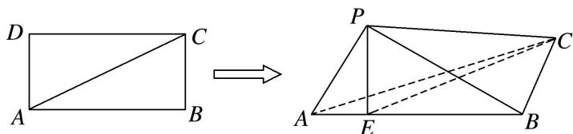

<!-- question-source:start -->
[例 5]如图，在长方形 ABCD 中，AB=4，BC=2，现将 $\triangle ACD$ 沿 AC 折起，使 D 折到 P 的位置且 P 在平面 ABC 的投影 E 恰好在线段 AB 上.

(1)证明： $AP \perp PB;$

(2)求三棱锥 P-EBC 的表面积.

<!-- question-source:end -->

![[高中/总复习/专题/立体几何/专题10 立体几何中的面积与体积问题-立体几何（文科）/考点01_几何体的面积问题/例题/answers/Q00043681A1.md]]
