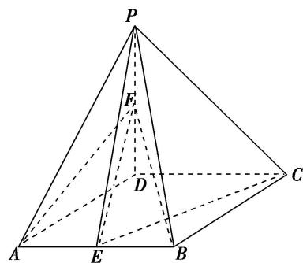
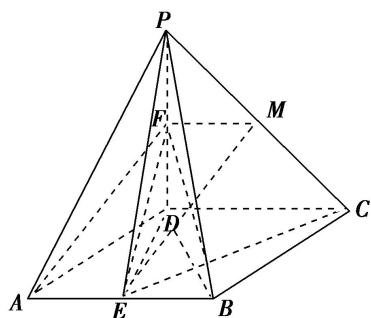

> [!faq]- 《专题10 立体几何中的面积与体积问题-立体几何（文科）》例题解析
>
> > [!success]- **【答案】** 详见解析
>
> > [!note]- **【分析】**
> > 本题未单列分析。
>
> > [!note]- **【解析】**
> > (1)求证：直线 $AF \parallel$ 平面 $PEC$ ;
> > (2)求三棱锥 P-BEF 的表面积.
> > 
> > 解析 (1)作 $FM \parallel CD$ 交 $PC$ 于 $M$ , 连接 $ME$ .
> > 
> > ∵点 F 为 PD 的中点，∴ $FM \stackrel{//}{=} \frac{1}{2} CD$ ，又 $AE \stackrel{//}{=} \frac{1}{2} CD$ ，∴ $AE \stackrel{//}{=} FM$ ，
> > ∴四边形 AEMF 为平行四边形，∴AF//EM，∵AF∉平面 PEC, EM⊂平面 PEC，∴直线 AF//平面 PEC.
> > (2)连接 ED, BD, 可知 ED⊥AB,
> > $$
> > \left. \begin{array}{l} P D \perp \text {平面} A B C D \\ A B \subset \text {平面} A B C D \end{array} \right\} \Rightarrow \quad \left. \begin{array}{l} P D \perp A B \\ D E \perp A B \end{array} \right\} \Rightarrow \quad \left. \begin{array}{l} A B \perp \text {平面} P E F \\ P E, F E \subset \text {平面} P E F \end{array} \right\} \Rightarrow A B \perp P E, A B \perp F E,
> > $$
> > $$
> > S _ {\triangle P E F} = \frac {1}{2} P F \cdot E D = \frac {1}{2} \times \frac {1}{2} \times \frac {\sqrt {3}}{2} = \frac {\sqrt {3}}{8}; S _ {\triangle P B F} = \frac {1}{2} P F \cdot B D = \frac {1}{2} \times \frac {1}{2} \times 1 = \frac {1}{4};
> > $$
> > $$
> > S _ {\triangle P B E} = \frac {1}{2} P E \cdot B E = \frac {1}{2} \times \frac {\sqrt {7}}{2} \times \frac {1}{2} = \frac {\sqrt {7}}{8}; S _ {\triangle B E F} = \frac {1}{2} E F \cdot E B = \frac {1}{2} \times 1 \times \frac {1}{2} = \frac {1}{4}.
> > $$
> > 因此三棱锥 P-BEF 的表面积 $S_{P-BEF}=S_{\triangle PEF}+S_{\triangle PBF}+S_{\triangle PBE}+S_{\triangle BEF}=\frac{4+\sqrt{3}+\sqrt{7}}{8}$ .
