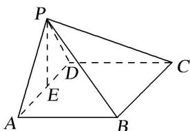

> [!faq]- 《专题10 立体几何中的面积与体积问题-立体几何（文科）》例题解析
>
> > [!success]- **【答案】** 详见解析
>
> > [!note]- **【分析】**
> > 本题未单列分析。
>
> > [!note]- **【解析】**
> > 解析
> > (1) $\because \angle BAP = \angle CDP = 90^{\circ}$ , $\therefore AB \perp PA$ , $CD \perp PD$ . $\because AB // CD$ , $\therefore AB \perp PD$ .
> >
> > 又∵ $PA\cap PD=P$ ，PA， $PD\subset$ 平面PAD，∴ $AB\perp$ 平面PAD.∵ $AB\subset$ 平面PAB，∴平面 $PAB\perp$ 平面PAD.
> >
> > 
> >
> > (2)取 AD 的中点 E，连接 PE. $\because PA=PD,\therefore PE\perp AD.$
> >
> > 由
> > (1)知， $AB \perp$ 平面 PAD， $PE \subset$ 平面 PAD，故 $AB \perp PE$ ，又 $AB \cap AD = A$ ，可得 $PE \perp$ 平面 ABCD. 设 AB = x，则由已知可得 $AD = \sqrt{2}x$ ， $PE = \frac{\sqrt{2}}{2}x$ ，
> >
> > 故四棱锥 P-ABCD 的体积 $V_{P-ABCD}=\frac{1}{3}AB\cdot AD\cdot PE=\frac{1}{3}x^{3}$ . 由题设得 $\frac{1}{3}x^{3}=\frac{8}{3}$ ，故 x=2.
> >
> > 从而 PA=PD=AB=DC=2，AD=BC= $2\sqrt{2}$ ，PB=PC= $2\sqrt{2}$ ，
> >
> > 可得四棱锥 P-ABCD 的侧面积为 $\frac{1}{2}PA\cdot PD+\frac{1}{2}PA\cdot AB+\frac{1}{2}PD\cdot DC+\frac{1}{2}BC^{2}\sin60^{\circ}=6+2\sqrt{3}$ .
