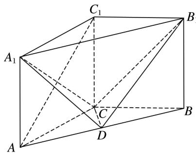

<!-- question-source:start -->
[例 2]如图，在三棱柱 $ABC-A_{1}B_{1}C_{1}$ 中， $AA_{1}\perp$ 平面 ABC， $AC\perp BC$ ， $AC=BC=CC_{1}=2$ ，点 D 为 AB 的中点.

(1)证明： $AC_{1} \parallel$ 平面 $B_{1}CD$ ;

(2)求三棱锥 $A_{1} - CDB_{1}$ 的体积.

<!-- question-source:end -->

![[高中/总复习/专题/立体几何/专题10 立体几何中的面积与体积问题-立体几何（文科）/考点02_几何体的体积问题/例题/answers/Q00043683A1.md]]
