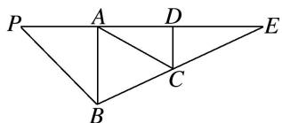
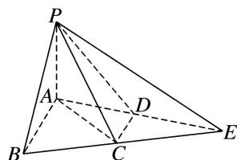

<!-- question-source:start -->
[例 3]如图，在 $\triangle PBE$ 中， $AB \perp PE$ ， $D$ 是 $AE$ 的中点， $C$ 是线段 $BE$ 上的一点，且 $AC = \sqrt{5}$ ， $AB = AP = \frac{1}{2} AE = 2$ ，将 $\triangle PBA$ 沿 $AB$ 折起使得二面角 $P - AB - E$ 是直二面角.

(1)求证： $CD \parallel$ 平面 PAB;

(2)求三棱锥 E-PAC 的体积.

(1)因为 $\frac{1}{2} AE = 2$ ，所以 $AE = 4$ ，又 $AB = 2$ ， $AB\bot PE$

所以 $BE=\sqrt{AB^{2}+AE^{2}}=\sqrt{2^{2}+4^{2}}=2\sqrt{5}$ ，又因为 $AC=\sqrt{5}=\frac{1}{2}BE$ ，

所以 AC 是 Rt△ABE 的斜边 BE 上的中线，所以 C 是 BE 的中点，又因为 D 是 AE 的中点，所以 CD 是 Rt△ABE 的中位线，所以 CD // AB，

又因为 CD $\nmid$ 平面 PAB，AB $\subset$ 平面 PAB，所以 CD // 平面 PAB.

(2)由
(1)知，直线 CD 是 Rt△ABE 的中位线，所以 $CD=\frac{1}{2}AB=1$ ，

因为二面角 P-AB-E 是直二面角，平面 $PAB \cap$ 平面 $EAB = AB, PA \subset$ 平面 $PAB, PA \perp AB,$

所以 $PA \perp$ 平面 ABE，又因为 AP = 2，

所以 $V_{E-PAC}=V_{P-ACE}=\frac{1}{3}\times\frac{1}{2}\times AE\times CD\times AP=\frac{1}{3}\times\frac{1}{2}\times4\times1\times2=\frac{4}{3}.$
<!-- question-source:end -->

![[高中/总复习/专题/立体几何/专题10 立体几何中的面积与体积问题-立体几何（文科）/考点02_几何体的体积问题/例题/answers/Q00043684A1.md]]
