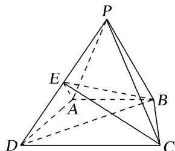
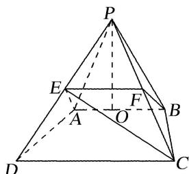

<!-- question-source:start -->
[例 4]如图，在四棱锥 P-ABCD 中，底面 ABCD 为等腰梯形， $AB \parallel CD$ ， $CD = 2AB = 4$ ， $AD = \sqrt{2}$ ， $\triangle PAB$ 为等腰直角三角形，PA = PB，平面 $PAB \perp$ 底面 ABCD，E 为 PD 的中点.

(1)求证： $AE \parallel$ 平面 PBC;

(2)求三棱锥 P-EBC 的体积.

(1)如图，取 $PC$ 的中点 $F$ ，连接 $EF$ ， $BF$

$\because PE=DE,\ PF=CF,\ \therefore EF\parallel CD,\ CD=2EF,$

∵ AB // CD, CD = 2AB, ∴ AB // EF，且 EF = AB.

∴四边形 ABFE 为平行四边形，∴AE∥BF.

∵ BF⊂平面 PBC, AE∉平面 PBC. 故 AE∥平面 PBC.

(2)由
(1)知 $AE \parallel$ 平面 $PBC$ , $\therefore$ 点 $E$ 到平面 $PBC$ 的距离与点 $A$ 到平面 $PBC$ 的距离相等,

$\therefore V_{P-EBC}=V_{E-PBC}=V_{A-PBC}=V_{P-ABC}$ . 如图，取 AB 的中点 O，连接 PO， $\because PA=PB,\therefore OP\perp AB.$

∵平面 $PAB \perp$ 平面 ABCD，平面 $PAB \cap$ 平面 ABCD = AB，OP ⊂ 平面 PAB，∴ OP ⊥ 平面 ABCD.

∵△PAB为等腰直角三角形，PA=PB，AB=2，∴OP=1.

∵四边形 ABCD 为等腰梯形，且 $AB \parallel CD$ ， $CD = 2AB = 4$ ， $AD = \sqrt{2}$ ，

∴梯形ABCD的高为1，∴ $S_{\triangle ABC}=\frac{1}{2}\times2\times1=1$ 。故 $V_{P-EBC}=V_{P-ABC}=\frac{1}{3}\times1\times1=\frac{1}{3}$
<!-- question-source:end -->

![[高中/总复习/专题/立体几何/专题10 立体几何中的面积与体积问题-立体几何（文科）/考点02_几何体的体积问题/例题/answers/Q00043685A1.md]]
