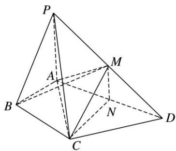

<!-- question-source:start -->
[例 5]如图，在四棱锥 P—ABCD 中， $\angle ABC = \angle ACD = 90^{\circ}$ ， $\angle BAC = \angle CAD = 60^{\circ}$ ，PA⊥平面 ABCD，PA = 2，AB = 1。设 M，N 分别为 PD，AD 的中点。

(1)求证：平面CMN//平面PAB;

(2)求三棱锥 P—ABM 的体积.

<!-- question-source:end -->

![[高中/总复习/专题/立体几何/专题10 立体几何中的面积与体积问题-立体几何（文科）/考点02_几何体的体积问题/例题/answers/Q00043686A1.md]]
