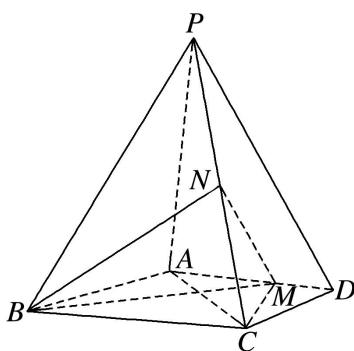

<!-- question-source:start -->
[例 6](2016·全国III)如图，四棱锥 P-ABCD 中，PA⊥底面 ABCD，AD∥BC，AB=AD=AC=3，PA=BC=4，M 为线段 AD 上一点，AM=2MD，N 为 PC 的中点.

(1)证明：MN//平面PAB;

(2)求四面体 N-BCM 的体积.

<!-- question-source:end -->

![[高中/总复习/专题/立体几何/专题10 立体几何中的面积与体积问题-立体几何（文科）/考点02_几何体的体积问题/例题/answers/Q00043687A1.md]]
