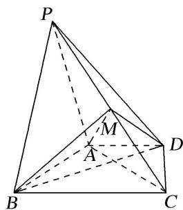

<!-- question-source:start -->
[例 7]如图，在四棱锥 P-ABCD 中，平面 $PAB \perp$ 平面 ABCD，PA=PB，AD//BC，AB=AC， $AD=\frac{1}{2}BC=1$ ，PD=3， $\angle BAD=120^{\circ}$ ，M 为 PC 的中点.

(1)证明： $DM / /$ 平面PAB；

(2)求四面体 MABD 的体积.

<!-- question-source:end -->

![[高中/总复习/专题/立体几何/专题10 立体几何中的面积与体积问题-立体几何（文科）/考点02_几何体的体积问题/例题/answers/Q00043688A1.md]]
