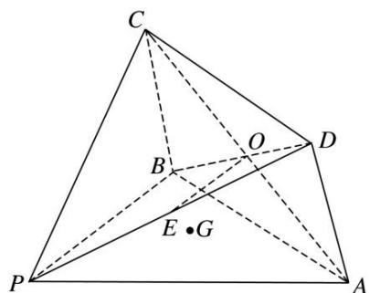

<!-- question-source:start -->
[例 8]如图所示的几何体 P—ABCD 中，四边形 ABCD 为菱形， $\angle ABC=120^{\circ}$ ，AB=a， $PB=\sqrt{3}a$ ， $PB\perp AB$ ，平面 ABCD⊥平面 PAB， $AC\cap BD=O$ ，E 为 PD 的中点，G 为平面 PAB 内任一点.

(1)在平面 $PAB$ 内，过 $G$ 点是否存在直线 $l$ 使 $OE \parallel l$ ? 如果不存在，请说明理由，如果存在，请说明作法；

(2)过 A, C, E 三点的平面将几何体 P—ABCD 截去三棱锥 D—AEC，求剩余几何体 AECBP 的体积.

<!-- question-source:end -->

![[高中/总复习/专题/立体几何/专题10 立体几何中的面积与体积问题-立体几何（文科）/考点02_几何体的体积问题/例题/answers/Q00043689A1.md]]
