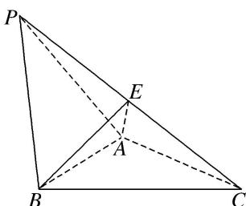

<!-- question-source:start -->
[例 1]在三棱锥 P-ABC 中， $\triangle PAB$ 是等边三角形， $\angle APC = \angle BPC = 60^{\circ}$ .

(1)求证： $AB \perp PC;$

(2)若 $PB = 4$ ， $BE\bot PC$ ，求三棱锥 $B - PAE$ 的体积.

<!-- question-source:end -->

![[高中/总复习/专题/立体几何/专题10 立体几何中的面积与体积问题-立体几何（文科）/考点02_几何体的体积问题/例题/answers/Q00043703A1.md]]
