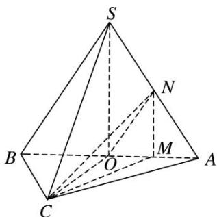

<!-- question-source:start -->
[例 2]如图，在三棱锥 S—ABC 中，SA=SB，AC=BC，O 为 AB 的中点，SO⊥平面 ABC，AB=4，OC=2，N 是 SA 的中点，CN 与 SO 所成的角为 $\alpha$ ，且 $\tan\alpha=2$ .

(1)证明： $OC \perp ON;$

(2)求三棱锥 S—ABC 的体积.

(1) $\because AC = BC, O$ 为 $AB$ 的中点， $\therefore OC \perp AB$ ，又 $SO \perp$ 平面 $ABC, OC \subset$ 平面 $ABC, \therefore OC \perp SO$ ，又 $AB \cap SO = O, AB, SO \subset$ 平面 $SAB, \therefore OC \perp$ 平面 $SAB,$ 又 $\because ON \subset$ 平面 $SAB, \therefore OC \perp ON.$

(2)设 $OA$ 的中点为 $M$ ，连接 $MN$ ， $MC$ ，则 $MN \parallel SO$ ，故 $\angle CNM$ 即为 $CN$ 与 $SO$ 所成的角 $\alpha$ ，又 $MC \perp MN$ 且 $\tan \alpha = 2$ ， $\therefore MC = 2MN = SO$ ，又 $MC = \sqrt{OC^2 + OM^2} = \sqrt{2^2 + 1^2} = \sqrt{5}$ ，即 $SO = \sqrt{5}$ ， $\therefore$ 三棱锥 $S - ABC$ 的体积 $V = \frac{1}{3}Sh = \frac{1}{3}\cdot \frac{1}{2}\cdot 2\cdot 4\cdot \sqrt{5} = \frac{4\sqrt{5}}{3}$ .
<!-- question-source:end -->

![[高中/总复习/专题/立体几何/专题10 立体几何中的面积与体积问题-立体几何（文科）/考点02_几何体的体积问题/例题/answers/Q00043704A1.md]]
