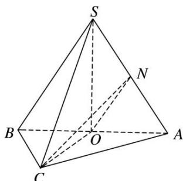

<!-- question-source:start -->
[例 2]如图，在三棱锥 S—ABC 中，SA=SB，AC=BC，O 为 AB 的中点，SO⊥平面 ABC，AB=4，OC=2，N 是 SA 的中点，CN 与 SO 所成的角为 $\alpha$ ，且 $\tan\alpha=2$ .

(1)证明： $OC \perp ON;$

(2)求三棱锥 S—ABC 的体积.

<!-- question-source:end -->

![[高中/总复习/专题/立体几何/专题10 立体几何中的面积与体积问题-立体几何（文科）/考点02_几何体的体积问题/例题/answers/Q00043704A1.md]]
