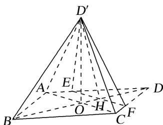

<!-- question-source:start -->
[例 3](2016·全国Ⅱ)如图，菱形 ABCD 的对角线 AC 与 BD 交于点 O，点 E，F 分别在 AD，CD 上，AE = CF，EF 交 BD 于点 H，将 $\triangle DEF$ 沿 EF 折到 $\triangle D'EF$ 的位置.

(1)证明： $AC \perp HD'$ ;

(2)若 $AB = 5$ ， $AC = 6$ ， $AE = \frac{5}{4}$ ， $OD' = 2\sqrt{2}$ ，求五棱锥 $D^{\prime} - ABCFE$ 的体积.

<!-- question-source:end -->

![[高中/总复习/专题/立体几何/专题10 立体几何中的面积与体积问题-立体几何（文科）/考点02_几何体的体积问题/例题/answers/Q00043705A1.md]]
