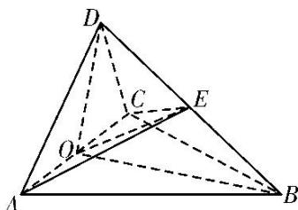

<!-- question-source:start -->
[例 4] (2017·全国III)如图，四面体 ABCD 中， $\triangle ABC$ 是正三角形，AD=CD.

(1)证明： $AC\bot BD$

(2)已知 $\triangle ACD$ 是直角三角形, $AB = BD$ , 若 $E$ 为棱 $BD$ 上与 $D$ 不重合的点, 且 $AE \perp EC$ , 求四面体 $ABCE$ 与四面体 $ACDE$ 的体积比.

(1)证明：取 $AC$ 的中点 $O$ ，连接 $DO$ ， $BO$ 。因为 $AD = CD$ ，所以 $AC \perp DO$ . 又由于 $\triangle ABC$ 是正三角形，所以 $AC \perp BO$ 。从而 $AC \perp$ 平面 $DOB$ ，故 $AC \perp BD$ 。

(2)连接 EO. 由
(1)及题设知 $\angle ADC = 90^{\circ}$ ，所以 DO = AO。在 Rt△AOB 中， $BO^{2} + AO^{2} = AB^{2}$ ，又 AB = BD，所以 $BO^{2} + DO^{2} = BO^{2} + AO^{2} = AB^{2} = BD^{2}$ ，故 $\angle DOB = 90^{\circ}$ 。

由题设知 $\triangle AEC$ 是直角三角形，所以 $EO = \frac{1}{2} AC$ 。又 $\triangle ABC$ 是正三角形，且 $AB = BD$ ，

所以 $EO=\frac{1}{2}BD$ 。故 E 为 BD 的中点，从而 E 到平面 ABC 的距离为 D 到平面 ABC 的距离的 $\frac{1}{2}$ ，四面体 ABCE 的体积为四面体 ABCD 的体积的 $\frac{1}{2}$ ，即四面体 ABCE 与四面体 ACDE 的体积之比为 1:1。
<!-- question-source:end -->

![[高中/总复习/专题/立体几何/专题10 立体几何中的面积与体积问题-立体几何（文科）/考点02_几何体的体积问题/例题/answers/Q00043706A1.md]]
