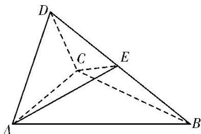

<!-- question-source:start -->
[例 4] (2017·全国III)如图，四面体 ABCD 中， $\triangle ABC$ 是正三角形，AD=CD.

(1)证明： $AC\bot BD$

(2)已知 $\triangle ACD$ 是直角三角形, $AB = BD$ , 若 $E$ 为棱 $BD$ 上与 $D$ 不重合的点, 且 $AE \perp EC$ , 求四面体 $ABCE$ 与四面体 $ACDE$ 的体积比.

<!-- question-source:end -->

![[高中/总复习/专题/立体几何/专题10 立体几何中的面积与体积问题-立体几何（文科）/考点02_几何体的体积问题/例题/answers/Q00043706A1.md]]
