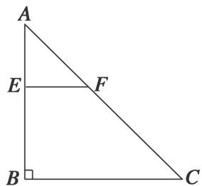
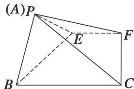

<!-- question-source:start -->
[例 5] 如图，在 Rt△ABC 中，AB=BC=4，点 E 在线段 AB 上。过点 E 作 EF∥BC 交 AC 于点 F，将 △AEF 沿 EF 折起到 △PEF 的位置(点 A 与 P 重合)，使得 ∠PEB=30°。

(1)求证： $EF \perp PB;$

(2)试问: 当点 $E$ 在何处时, 四棱锥 $P—EFCB$ 的侧面 $PEB$ 的面积最大? 并求此时四棱锥 $P—EFCB$ 的体积.

(1)∵EF∥BC且BC⊥AB，∴EF⊥AB，即EF⊥BE，EF⊥PE.又BE∩PE=E，∴EF⊥平面PBE，又PB⊂平面PBE，∴EF⊥PB.

(2)设 BE=x, PE=y，则 $x+y=4$ . $\therefore S_{\triangle PEB}=\frac{1}{2}BE\cdot PE\cdot\sin\angle PEB=\frac{1}{4}xy\leqslant\frac{1}{4}\left(\frac{x+y}{2}\right)^{2}=1$ .

当且仅当 x=y=2 时， $S_{\triangle PEB}$ 的面积最大．此时，BE=PE=2.

由
(1)知 $EF \perp$ 平面 PBE，∴平面 $PBE \perp$ 平面 EFCB，

在平面 PBE 中，作 $PO \perp BE$ 于 O，则 $PO \perp$ 平面 EFCB。即 PO 为四棱锥 P—EFCB 的高。

$$
P O = P E \cdot \sin 3 0 ^ {\circ} = 2 \times \frac {1}{2} = 1. S _ {E F C B} = \frac {1}{2} \times (2 + 4) \times 2 = 6. \therefore V _ {P - B C F E} = \frac {1}{3} \times 6 \times 1 = 2.
$$

## 3. 线面垂直+体积模型

【例题选讲】
<!-- question-source:end -->

![[高中/总复习/专题/立体几何/专题10 立体几何中的面积与体积问题-立体几何（文科）/考点02_几何体的体积问题/例题/answers/Q00043707A1.md]]
